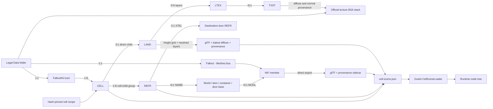
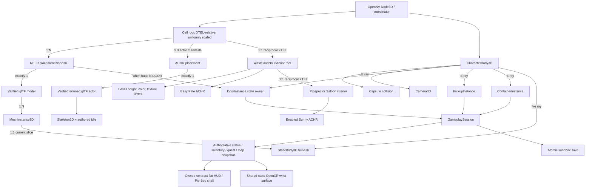
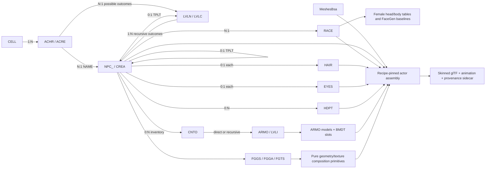
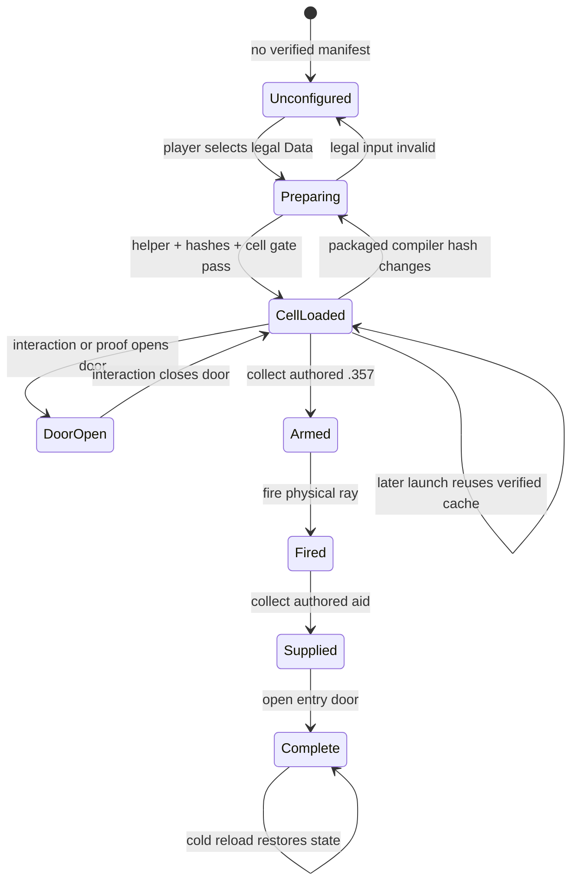
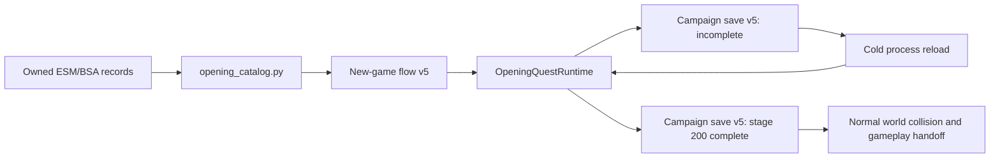
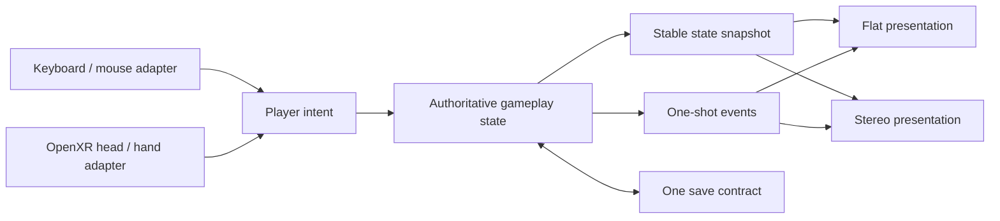

# OpenNV architecture and code accountability

Status: **launcher-routed bounded Fallout 1 V13ENT and New Vegas opening/
Goodsprings slices, a non-playable Fallout 3 CG00 development frontend, and a bounded Fallout 2
Temple/Arroyo MAP/PRO/FRM presentation plus an owned premade-to-Map-3
development route over registered DAT2 overlays; no full campaign**.

The compact launcher exposes four core game cards. Fallout 1 has a bounded
Godot Vault 13/V13ENT opening slice in Hex and FPS; its OpenXR adapter is
simulator-only and launcher-disabled. Fallout 2 admits the owned Map 126 and Map 3
MAP/PRO/FRM source graphs and renders Arroyo Caves in Godot's 3D hex space. Its
bounded character-start surface selects Narg, Mingan, or Chitsa from owned
GCD/BIO/panel data, applies sex-correct HMWARR/HFPRIM presentation, and hands
Take to the grounded source-walk-gated player at Map 3 tile 28707. Its atomic
OpenNV user-data save cold-restores the selected source state and current Map 3
transform/mode. Modify/Create, campaign-wide persistence, script/campaign
systems, reciprocal exits, FPS/OpenXR, parity, and launcher readiness remain
absent.
New Vegas owns its menu, skippable intro, Doc Mitchell house/state, a
hash-verified gameplay-UI contract rooted in the retail HUD/STATS/ITEMS/DATA
XML closures, and the bounded ordered Doc house → Goodsprings exterior → saloon
composite with reciprocal exits (`00103e61` ↔ `00103e69`, then
`0010636f` ↔ `0010618e`) and normally enabled Sunny `00104e85`; flat is
launchable. From a completed stage-200 Continue, its accepted forward flat route
uses configured input through both XTEL links and campaign save v5 cold-restores
saloon CELL `00106185`; OpenXR remains experimental with no physical-headset
acceptance.
Configured flat `Tab`/`Escape` now opens and closes the populated owned campaign
Pip-Boy surface through Godot's input-event path. The accepted surface uses the
owned background, bitmap fonts, and source rectangles, but it does not execute
the complete Gamebryo tile graph and is not retail-pixel parity.
Fallout 3 owns its menu and persistent CG00 selection through stage 62; later
Section 4 and stage-65/80/85 contracts validate but do not bypass unimplemented
world triggers. It has no Vault 101 runtime. TTW runtime support is absent, and JAM remains dependency- and
portable-semantic-gated. These routes consume the shared authoritative state in
`runtime/src/Gameplay/State`; presentation does not fork inventory, quests,
objectives, opening completion, or save identity.

The active priority, full product definition, milestone sequence, and
publication rules live in the canonical
[whole-game delivery plan](whole-game-delivery-plan.md). This document owns
architecture and current implementation truth, not a competing roadmap.

OpenNV is a clean first-party runtime. The retail installation is a read-only
input, the generated cache is disposable, every cross-boundary artifact has a
schema and hashes, and no OpenMW runtime or source code participates.
The executable-value rules, single configuration path, and source gate are
defined in [data and configuration accountability](data-and-configuration-accountability.md).
The official-stack actor/template/placement graph and exact meaning of a
whole-game visual pass are defined in
[whole-game actor and creature parity](whole-game-actor-creature-parity.md).
The official-stack CELL/child/portal denominator and exact meaning of a working
CELL are defined in [whole-game CELL parity](whole-game-cell-parity.md).

## New Vegas owned-data world path

The actor data boundary is separate from model assembly and rendering:

`actor_catalog.py` owns these record relationships and preserves authored
placement/enable state; `facegen.py` owns deterministic FaceGen identity geometry
and body-texture math, while `facegen_animation.py` strictly decodes the owned
LIP/TRI animation formats. Head base, normal, NPC detail, and tone inputs remain
separate until the runtime FaceGen material pass. Authored TRI differential and
static targets remain named glTF morphs, and runtime speech samples those targets
from the paired voice stream's playback clock. This
keeps record parsing independent from the whole-game load-order/review corpus,
`prepare_actor.py`, which still resolves one hash-pinned compiled slice, and
`actor_gltf.py`, which owns only the skinned glTF, FaceGen targets,
material-flag, alpha, bind, and animation translation. None of those files
creates a Godot node or claims that a rendered actor matches retail.

## Runtime states

## Owned opening and campaign-state handoff

The New Vegas opening is compiled from the owned QUST, INFO, script-command,
reference, item, global, package, animation, voice, LIP, and NAVM graph. The
compiler emits `opennv-owned-new-game-flow/v5` plus an exact command-contract
inventory. Every command kind is accounted for, and every declared item, quest,
global, owner, and placed-reference editor identity is joined to one stable
FormID and record type before the cache can be promoted. The runtime independently
recounts that contract and rejects missing identities, unsupported operations,
or a configuration-hash mismatch.

The campaign state preserves character creation, quest variables and lifecycle,
globals, objectives, achievements, exact inventory/equipment identities,
reference state, control state, and player/guide transforms. The authored
autosave is the only checkpoint boundary. During the opening, player grounding
projects configured input onto the owned NAVM graph so the authored bed and
interior collision cannot leave the player floating or trapped. That opening-only
adapter is removed at completion; it does not become a general collision bypass.
The two-process acceptance first stops on the owned autosave, then reloads that
same file and must reach the owned completion stage. This proves the bounded
opening handoff, not a complete campaign, Pip-Boy, HUD, or mod-compatibility claim.

## First-class flat/VR boundary

VR is a product mode, not a later camera patch. Before the next gameplay system
is promoted, desktop and OpenXR must share one authoritative intent/state/event
path:

`CellPlayer` now constructs either a flat camera/input rig or a real OpenXR
origin, tracked head, left/right grip publishers, and left/right aim publishers
over the same `GameplaySession`. `DesktopInputMap` builds the keyboard/mouse
actions from the single runtime configuration; the XR action resource declares
the corresponding controller boundary. `GameplaySession` renders either its flat HUD or a
controller-mounted world-space HUD without duplicating inventory, objective, or
save rules. This remains bounded vertical-slice code; actor, combat, VATS, and
quest rules may not accumulate there. No unused VR manager, empty interface, or
speculative abstraction counts as progress.

The layout-only OpenXR gate proves the action map and required node hierarchy.
The repo-local simulator gate additionally proves both tracked retail hands,
both sticks, locomotion, HMD-pivot snap turn, data-derived door activation,
10mm fire/reload/save, supported eye height, wrist HUD, and native stereo
projection without Windows app control. The flat event-pipeline gate proves the
configured physical key/mouse bindings and the same gameplay outcomes. Promotion to
hardware-validated requires a real stereo run with head/two-controller poses,
room-scale collision, controller actions/haptics, identical route/save results,
and stereo-safe materials. Gameplay outcomes remain mode-independent; only
input translation and presentation differ.

The Saloon practice table follows this boundary. `PoolTableInstance` owns the
four recipe-pinned balls, authored reset state, pocket state, cue presentation,
and the single strike operation. `PoolBallInstance` is one hash-verified NIF
convex rigid body. Desktop look/power and tracked OpenXR cue-tip sweeps call the
same strike operation; `GameplaySession` serializes the resulting transforms,
velocities, and pocket state. The software gate requires an actual ball-to-ball
contact in both adapters. Physical headset pose, grip comfort, and haptics still
require a headset session.

## Performance observation

`RuntimePerformanceObserver` passively samples Godot's own FPS, process and
physics-process time, node and orphan-node counts, static memory, and rendered
object and primitive monitors at the interval owned by the versioned runtime
configuration. It retains sample count plus minimum, maximum, and arithmetic
mean for every metric. An explicit `--perf-report <path>.json` writes one atomic
report when the runtime exits; without that option it performs no file I/O.
This is observation only: the report contains no guessed pass/fail threshold,
retail data, or promotion verdict.

## Source ownership

| File | Sole responsibility | Must not own |
| --- | --- | --- |
| `plugin_records.py` | Bounded TES4-family headers, groups, compression, subrecords | Cell or rendering semantics |
| `plugin_stack.py` | Master-aware stable FormIDs, official load-order mapping, and source identity | Actor, cell, or rendering semantics |
| `cell_catalog.py` | CELL/base/REFR relationships plus bounded CELL and linked `LIGH` field decoding | BSA/NIF/Godot behavior |
| `cell_parity_records.py` | Canonical CELL/child rows, `XRDS` reference radius, linked light contracts, source accounting, and effective override/deletion merge | Resource compilation, runtime streaming, or parity verdicts |
| `cell_parity_corpus.py` | Official-stack CELL graph, implicit-base/source-anomaly contracts, relationship closure, and complete pending review ledger | Runtime implementation or parity promotion |
| `validate_cell_parity_corpus.py` | Artifact hashes, raw/effective conservation, relationship closure, pending-state enforcement, and exact actor-placement join | Content compilation or visual approval |
| `corpus_io.py` | Deterministic atomic JSON/JSONL corpus artifacts and descriptors | Record or game semantics |
| `cell_compile_plan.py` | Natural CELL partitioning, exact child membership, deduplicated capability requirements, and absent-output scheduling | Content implementation, runtime nodes, or parity promotion |
| `validate_cell_compile_plan.py` | Source-corpus binding, partition hashes, exact job/child/capability coverage, and pending-state enforcement | Asset compilation or runtime claims |
| `cell_static_compile.py` | One planned CELL's typed capability orchestration, immutable artifact transaction, exact child accounting, and explicit blockers | Record layouts, resource conversion, Godot nodes, gameplay, or parity promotion |
| `cell_static_contract.py` | Static CELL schemas, presentation-policy validation, coordinate/light contracts, failure normalization, and producer-source closure | Archive reads, compilation, or Godot nodes |
| `cell_static_source.py` | Exact compile-job to corpus CELL/child/base/portal join | Asset conversion or runtime behavior |
| `cell_landscape_contract.py` | Pure stable LAND placement, topology-count, and texture-graph artifact contract | Owned-data reads, cache writes, or runtime nodes |
| `cell_landscape_compile.py` | One resolved LAND's height mesh, layer bake, collision declaration, and shared artifact rows | Plugin-stack resolution, CELL orchestration, or Godot nodes |
| `cell_landscape_validate.py` | Independent LAND identity, source graph, sidecar, material, and baked-texture expectation | Generic asset validation or runtime loading |
| `cell_static_resource_validate.py` | Generic NIF/LAND asset, texture, nested-output, and filesystem-closure validation | CELL policy, record resolution, or visual approval |
| `validate_cell_static_compile.py` | Exact plan/corpus/archive/configuration join plus typed placement/blocker/count orchestration | Resource-specific decoding, runtime loading, or visual approval |
| `actor_catalog.py` | ACHR/ACRE, NPC_/CREA, TPLT/EAMT, LVLN/LVLC, RACE, HAIR, EYES, HDPT, ARMO, FaceGen and placement relationships | Mesh assembly or rendering |
| `actor_parity_graph.py` | Recursive category-source appearance variants and concrete leveled placement candidates | Binary parsing, capture, or rendering |
| `actor_parity_records.py` | Canonical actor rows and effective override/deletion merge | Template traversal, capture, or rendering |
| `actor_parity_corpus.py` | Official-stack composition and complete private review-ledger generation | Actor-specific fixes or parity verdicts |
| `validate_actor_parity_corpus.py` | Corpus hashes, uniqueness, graph closure, and exact review coverage | Rendering or automatic visual approval |
| `actor_capture_plan.py` | Exact review-ledger projection into resumable fixed/dynamic base observation jobs | Launching engines or claiming visual parity |
| `validate_actor_capture_plan.py` | Capture-plan hashes, source-stack join, batch membership, and exact outcome coverage | Image comparison or changing evidence status |
| `actor_review_contract.py` | One classified review row joined to immutable retail frames, final-eye D3D9 projection, animation, hierarchy, and skin-palette evidence | Owned-asset compilation or parity verdicts |
| `prepare_creature_review.py` | One CREA review contract compiled from the owned official archive stack into a disposable generic actor-review scene | Retail capture, Godot runtime behavior, or comparison verdicts |
| `actor_review_differential.py` | Exact retail/Godot sample pairing, hash verification, objective image/structure gates, side-by-side stills, retail-timed motion clip, and one fail-closed ledger row | Importing assets, altering capture state, or human approval |
| `actor_review_coverage.py` | Exhaustive join of every corpus appearance and placement to unique differential evidence with aggregate missing/failed/unreviewed counts | Sampling, visual approval, or changing evidence verdicts |
| `facegen.py` | Pure EGM/EGT geometry morph and retail body-texture composition primitives | Record selection, head-material composition, or runtime nodes |
| `facegen_animation.py` | Strict configuration-driven owned LIP/TRI decoding, interpolation, and named differential/static morph contracts | Voice selection, Godot nodes, expression policy, or controller guesses |
| `actor_gltf.py` | One actor skeleton/skin/mesh/idle assembly to glTF, including exact sibling TRI morph targets, provenance, and stable per-surface runtime identities, with an explicit gate against silently omitted render geometry | Record selection, placement, particle simulation, or runtime behavior |
| `first_person_rig.py` | Hash-verified legal left/right first-person hand artifacts plus skeleton/pose/frame contract | Runtime tracking or weapon behavior |
| `actor_material.py` | Bethesda actor shader, tint, vertex-color, specular, alpha, and separate FaceGen sampler contracts | Geometry, records, or runtime lighting |
| `prepare_actor.py` | Hash-pinned retail actor recipe resolution and atomic disposable cache output | Godot loading or parity verdicts |
| `render_actor_preview.py` | Native Godot preview/capture orchestration for one prepared actor | Actor export, desktop control, or parity approval |
| `bsa_archive.py` | Indexed BSA v104 member lookup and extraction | Record or scene semantics |
| `dat2_archive.py` | Indexed Fallout DAT2 member lookup, decompression, and hash identity | MAP/PRO/FRM semantics |
| `fo2_profile.py` | Read-only Fallout 2 root-archive DAT2/index identity and source-only launcher profile | Member extraction, caches, runtime readiness, or playability |
| `fo2_first_slice.py` | Effective patch/critter/master overlay resolution and exact asset-free Temple MAP header/elevation, entry marker, placed-object, PRO, and FRM identity manifest | Character creation, new-game executable policy, Godot loading, gameplay, saves, runtime readiness, or playability |
| `prepare_fo2_temple_presentation.py` | Deterministic disposable local PNG cache for exact Map 126 floor/roof tile frames and MAP-admitted object frame/rotation pairs, with owned-palette and artifact provenance | Source selection, 3D substitution, Godot loading, gameplay, packaging, runtime readiness, or playability |
| `prepare_fo2_character_start.py` | Exact 432-byte premade GCD parsing and disposable local picker/panel/biography plus sex-correct idle-FRM cache generation | Custom character policy, runtime selection, persistence, packaging, or playability |
| `export_static_nif_gltf.py` | NIF static geometry, winding/stencil culling metadata, glTF, and provenance | World placement or gameplay |
| `havok_collision_gltf.py` | Bounded authored packed triangles plus convex/list dynamic body, shape, mass, friction, bounce, damping and filter export | Runtime body policy or unsupported shape guessing |
| `gltf_io.py` | Deterministic buffer/accessor packing and atomic glTF artifact writes | NIF, LAND, actor, or gameplay semantics |
| `cell_scene.py` | Recipe selection, XTEL origin, full Gamebryo-to-Godot transform/scale conversion, asset/reference/material manifest | Godot nodes or input |
| `material_contract.py` | Shared NIF-surface to runtime material binding translation | Mesh export, archive lookup, or Godot resources |
| `scene_asset_pipeline.py` | Shared bounded-scene NIF extraction, interactions, and data-resolved loadout artifacts | CELL selection or Godot nodes |
| `exterior_scene.py` | Bounded grid/persistent reference selection, reciprocal XTEL and exterior manifest | LAND decoding or runtime nodes |
| `landscape_catalog.py` | LAND ownership, height/normal/color, LTEX/TXST and quadrant-layer contracts | Godot nodes or weather |
| `landscape_gltf.py` | One LAND grid plus deterministic owned-texture layer bake and provenance | CELL selection or runtime physics |
| `landscape_stack.py` | Exact corpus-bound LAND source plus master-aware effective LTEX/TXST winners | Geometry export, cache writes, or Godot behavior |
| `texture_pipeline.py` | Embedded-name texture-BSA lookup and DDS-to-PNG cache | Runtime material policy |
| `prepare_legal_assets.py` | Legal-input validation and atomic cache transaction | Rendering |
| `goodsprings-saloon-structure-v1.json` | Exact proof target, hash, selection, entry, scale | Parsing logic |
| `goodsprings-trudy-actor-v1.json` | Exact retail master/archives, ACHR, and CELL identity | Appearance guesses or rendering logic |
| `runtime/config/open-nv-runtime-v1.json` | Single versioned non-retail policy boundary with provenance and parity status | Fallout-authored placement, identity, or item stats |
| `runtime/config/jam-trusted-requirements-v1.json` | Shipped JAM recipe identity and exact known plugin-to-portable-capability binding | JAM assets, native DLL execution, or unverified semantic claims |
| `runtime_configuration.py` / `RuntimeConfiguration.cs` | Strict typed load, validation, and SHA-256 identity for that boundary | Feature behavior |
| `validate_runtime_report.py` | Join runtime proof reports to owned-data manifests and configuration | Rendering or gameplay implementation |
| `audit_source_constants.py` | Production Python/C#/JavaScript/PowerShell literal accountability gate | Runtime defaults or content policy |
| `test_cell_catalog.py` | Synthetic group/relationship/transform regressions | Retail bytes |
| `test_cell_parity_corpus.py` | Synthetic official-stack merge, deletion, portal, implicit-base, source-anomaly, conservation, and actor-join regressions | Retail bytes or runtime claims |
| `test_cell_compile_plan.py` | Synthetic CELL job, partition, child, capability-set, and source-anomaly assignment regressions | Asset compilation or readiness claims |
| `test_actor_catalog.py` | Synthetic actor identity/appearance/placement graph regressions | Mesh or renderer assertions |
| `test_facegen.py` | Synthetic geometry, texture-mode, skin, and body composition regressions | Retail actor selection |
| `test_actor_gltf.py` | Bethesda material, alpha, vertex-color, and non-accumulating idle translation regressions | Retail visual approval |
| `test_static_nif_gltf.py` | Synthetic BSA/NIF geometry regressions | Runtime orchestration |
| `test_dat2_archive.py` | Synthetic DAT2 index/member/decompression regressions | Retail bytes |
| `test_fo1_map_objects.py` | Synthetic Fallout MAP object/script-layout regressions | Cross-game mapping or rendering |
| `test_fo1_frm.py` | Synthetic palette, shared-direction FRM, preview, and truncation regressions | Retail bytes or 3D substitution |
| `test_fo1_concept_composition.py` | Synthetic bounded composition, door replacement, offset, light, and overwrite regressions | Retail visual approval |
| `test_fo1_hex_scene.py` | One-metre topology, reversed floor-X projection, four-hex mapping, unprojection, critter PRO, crop, and bounds regressions | Retail bytes or runtime input |
| `test_fo1_runtime_profile.py` | Runtime-profile hash/path/schema/provenance and adaptation-leak regressions | Visual approval or campaign-promotion claims |
| `test_fo1_campaign_inventory.py` | Synthetic all-map inventory, identity, and monotonic-promotion regressions | Retail bytes or campaign-readiness claims |
| `OpenNV.Content.spec` | One-file helper inputs and packaged recipe/data files | Content semantics |
| `LegalAssetPreparer.cs` | Packaged-helper process and cache/compiler validation | Record parsing |
| `opening_catalog.py` | Owned opening QUST/INFO/script graph, exact command identities, versioned flow contract, and hash-bound HUD/STATS/ITEMS/DATA XML/font/texture contract | Runtime state, Gamebryo tile execution, or Godot UI |
| `runtime/src/Campaigns/NewVegas/Opening/NewVegasOpeningNamespaceBridge.cs` | Compile-time namespace join between the New Vegas opening campaign and shared runtime composition | Runtime behavior, routing, or campaign abstractions |
| `runtime/src/Campaigns/NewVegas/Opening/OpeningFlowManifest.cs` | Flow/configuration/command-contract parsing and fail-closed runtime validation | Command execution or save state |
| `runtime/src/Campaigns/NewVegas/Opening/OpeningManifest.cs` | Owned New Vegas front-end manifest identity, hash verification, and typed menu/media/gameplay-UI contract loading | Menu rendering, command execution, or source compilation |
| `runtime/src/Campaigns/NewVegas/Opening/OpeningQuestRuntime.cs` | Data-driven opening command interpreter, authored UI/dialogue/AI progression, checkpoint capture, and completion handoff | ESM/BSA parsing or guessed content identities |
| `runtime/src/Gameplay/State/OpeningCampaignState.cs` | Shared versioned opening character/quest/objective/inventory snapshot validation and transform serialization | Flow progression or file I/O |
| `runtime/src/Presentation/Ui/OwnedUiContracts.cs` | Campaign-neutral owned texture, bitmap-font, style, role, and gameplay-presentation value contracts | Parsing, extraction, state mutation, or UI nodes |
| `runtime/src/Presentation/Ui/OwnedUiTheme.cs` | Owned bitmap-font, texture, and UI-style construction shared by opening and gameplay presentation | Manifest parsing, progression, or UI state |
| `runtime/src/Campaigns/NewVegas/Opening/RetailOpening.cs` | Owned New Vegas main-menu and intro playback/skip presentation | Manifest parsing, gameplay progression, or campaign state |
| `runtime/src/Presentation/Ui/GameplayUiModel.cs` | One read-only inventory/equipment/quest/objective/map/control snapshot over authoritative gameplay state | Mutation, save ownership, or presentation layout |
| `runtime/src/Presentation/Ui/GameplayUiController.cs` | Flat HUD/Pip-Boy and status-only shared-state wrist presentation; New Vegas flat UI consumes the owned XML/font/texture/rectangle role contract, STATS explicitly reuses the verified ITEMS frame, and the wrist consumes its owned font/theme path | Campaign state, asset extraction, native STATS rectangle evaluation, ITEMS/DATA wrist navigation, full Gamebryo tile execution, or retail-parity claims |
| `VerifiedGltfLoader.cs` | Sidecar/model/buffer hash verification and glTF load | Cell placement |
| `CellContentLoader.cs` | One verified CELL presentation/entity root with authored collision instances | Binary parsing or player ownership |
| `CellSceneLoader.cs` | Shared session/view composition, linked CELL alignment, reciprocal portal composition, active collision-layer selection, and proof queries | Binary parsing or portal gameplay decisions |
| `RuntimeMaterialLoader.cs` | Hash-verified 2D/cubemap load and name-keyed retail material passes | DDS/BSA parsing |
| `StaticCellCompileArtifact.cs` | Static compile schema/configuration/hash/path/count verification and immutable row load | Godot node construction |
| `StaticCellCompileLoader.cs` | Verified relative artifact load, profile-typed static/point-light placement instantiation, CELL lighting, and authored collision | Record parsing, actors, gameplay, or parity claims |
| `ActorModelSlice.cs` | Hash-verified skinned glTF import, idle start, and non-accumulating bounds contract | Record parsing or placement |
| `RetailFaceGenMaterial.cs` | Hash-verified runtime FaceGen sampler composition, encoded-color transfer, and opaque/depth-write enforcement | Record selection, texture extraction, actor placement, or lighting policy |
| `CellActorLoader.cs` | Actor-manifest identity, CELL ownership, enable-state gate, and ACHR placement | Actor export or AI state simulation |
| `RetailActorStateContract.cs` | Fail-closed retail shot-state parsing for ACHR transform, camera, idle phase, arm bones, and face/hair hashes | Process addresses, asset parsing, or rendering |
| `EnvironmentCapture.cs` | Native cell/actor frames, application of validated retail shot state, normalized telemetry, hashes, and visual-quality gates | Gameplay or desktop control |
| `actor_parity.py` | Retail/Godot identity, camera, pixel metrics, and labelled differential sheets | Rendering or automatic human approval |
| `DoorInstance.cs` | One door's closed/open transform state | Input or global registry |
| `PickupInstance.cs` | One authored pickup's identity and weapon profile | Inventory ownership |
| `ContainerInstance.cs` | One authored container's resolved content contract | Session persistence |
| `PoolBallInstance.cs` | One authored dynamic convex body and its persisted motion/pocket state | Table rules or input |
| `PoolTableInstance.cs` | One table assembly, cue presentation, shared strike/reset/pocket behavior, and ball ownership | Input polling or asset parsing |
| `runtime/src/Gameplay/State/GameplayStateNamespaceBridge.cs` | Compile-time namespace join between shared authoritative state and its campaign, world, and presentation consumers | Runtime behavior or gameplay abstractions |
| `runtime/src/Gameplay/State/GameplaySession.cs` | Shared authoritative inventory/world delta, active-CELL identity, objective state, opening-completion envelope, pool snapshots, and atomic save/reload | Asset parsing, portal geometry, or opening progression |
| `runtime/src/Gameplay/Containers/` | Source-named two-column container view plus authoritative per-reference remaining counts and transfer operations | Player-to-container deposits, barter, or retail-pixel parity |
| `CellPlayer.cs` | Shared collision body plus flat/OpenXR view, movement, activation, firing, and pool-input adapters | Asset preparation or gameplay outcomes |
| `runtime/src/World/Portals/CellPortalTravel.cs` | Production reciprocal-XTEL activation, owned arrival transform, active collision layer, and authoritative CELL transition | Input synthesis, save serialization, or content parsing |
| `DesktopInputMap.cs` | Configured physical key/mouse events to named Godot actions | Gameplay decisions or Windows input injection |
| `FirstPersonRig.cs` | Verified hand import and retail Camera1st/Weapon/grip-frame alignment | Content extraction or controller polling |
| `PlayerControlTelemetry.cs` | Simulator-only pose, locomotion, floor-height, snap-pivot, and action acceptance measurements | Input synthesis or gameplay mutation |
| `runtime/src/Presentation/OpenXR/XrSimulatorAcceptance.cs` | Time-bounded simulator observation and evidence report for tracked hands, sticks, locomotion, interactions, weapon, save, and floor height | Input synthesis or headset claims |
| `FlatControlsAcceptance.cs` | Configured Godot keyboard/mouse event acceptance over the shared gameplay path | Windows input injection or gameplay rules |
| `runtime/src/World/Portals/CellRouteTravelAcceptance.cs` | Bounded forward configured-input route and v4 cold-Continue evidence report | Portal rules, reverse-traversal claims, OpenXR acceptance, or world streaming |
| `runtime/src/Presentation/OpenXR/OpenXrNamespaceBridge.cs` | Compile-time namespace join between OpenXR acceptance and shared runtime composition | Runtime behavior, input translation, or presentation abstractions |
| `runtime/src/Presentation/OpenXR/XrRigLayoutAcceptance.cs` | Headless OpenXR action-map, node hierarchy, HUD, and shared weapon-state layout gate | Simulator or headset claims |
| `RuntimeCoordinator.cs` | Startup option routing, composition, shared report writing, and shutdown ownership | Feature-specific acceptance logic, UI construction, or file-format parsing |
| `runtime/src/Diagnostics/Performance/RuntimePerformanceObserver.cs` | Allocation-free periodic sampling and optional threshold-free JSON summary of Godot performance monitors | Gameplay behavior, acceptance thresholds, proprietary data, or subsystem management |
| `LegalAssetSetupView.cs` | First-run folder selection and status UI | Preparation or rendering |
| `StaticModelSlice.cs` | Hash-verified one-model material binding, bounds, and reference view | Cell relationships or controller playback |
| `StaticModelCapture.cs` | Native hash-recorded one-model visual gate | Cell placement, interaction, or retail parity |
| `runtime/src/Campaigns/Fallout1/Fallout1NamespaceBridge.cs` | Compile-time namespace join between the Fallout 1 campaign and shared runtime composition | Runtime behavior, routing, or campaign abstractions |
| `runtime/src/Campaigns/Fallout1/Fo1HexMath.cs` | Fallout 200×200 tile IDs, retail even-column-offset world conversion, direction/neighbor/distance/corner math | Rendering, AP, or source parsing |
| `runtime/src/Campaigns/Fallout1/Fo1RuntimeProfile.cs` | Strict typed ownership of the embedded versioned 3D adaptation profile | Fallout source authority or fallback tuning |
| `runtime/src/Campaigns/Fallout1/Fo1HexSceneLoader.cs` | Verified V13ENT floor/sprite/door manifests, diagnostic overlays, and ordinary Godot presentation nodes | MAP parsing, camera input, or gameplay rules |
| `runtime/src/Campaigns/Fallout1/Fo1TacticalSession.cs` | V13ENT player hex, BFS movement, selected target, bounded attack/rat turn, HP/AP HUD, and atomic proof save | Camera transforms, MAP parsing, or full AI formulas |
| `runtime/src/Campaigns/Fallout1/Fo1Mob.cs` | One source critter's PID/serial/tile, MAP runtime state, PRO combat values, grounded 2D/3D presentation and depth-safe markers, HP/AP, and proof movement | Turn ordering, pathfinding, or asset extraction |
| `runtime/src/Campaigns/Fallout1/Fo1CreatureModel.cs` | Hash-verified owned creature glTF binding, animation selection, and intact-state gore-cap visibility | Source critter identity or combat rules |
| `runtime/src/Campaigns/Fallout1/Fo1OwnedCaveKit.cs` | Exact-source-topology continuous floor construction and verified owned cave-kit instantiation from the presentation manifest | Fallout 1 topology derivation or camera policy |
| `runtime/src/Campaigns/Fallout1/Fo1CaveCutaway.cs` | Camera-to-focus occluder visibility for registered cave instances | Asset placement, gameplay state, or source parsing |
| `runtime/src/Campaigns/Fallout1/Fo1TacticalCamera.cs` | Orthographic orbit/pan/cursor-zoom/edge/focus input adapter | Hex state, AP, or content preparation |
| `runtime/src/Campaigns/Fallout1/Fo1HexProof.cs` | Headless mouse-camera, one-hex/one-AP, end-turn, and save gate | Production input or visual approval |
| `runtime/src/Campaigns/Fallout1/Fo1HexCapture.cs` | Native V13ENT UI/environment frames, metrics, hashes, and no-host-control record | Gameplay or parity verdicts |
| `runtime/src/Campaigns/Fallout1/Fo1HexDemo.cs` | Deterministic loading/player/door/movement/target/attack/turn video sequence and report | Host input injection, gameplay authority, or parity verdicts |
| `runtime/src/Campaigns/Fallout1/Fo1HexVisuals.cs` | Procedural selection/path marker mesh and material primitives | Grid identity, pathfinding, or source art |
| `runtime/src/Campaigns/Fallout2/Temple/Fo2TemplePresentationContract.cs` | Full cache/source/profile/recipe and PNG identity validation for the admitted Map 126 presentation | DAT2 parsing, invented placements, gameplay, or runtime readiness |
| `runtime/src/Campaigns/Fallout2/Temple/Fo2TempleTopology.cs` | Source-derived floor support, central-hex blocker walk mask, connected wall shells, and bounded collision for Map 126 | Multihex footprint guessing, scripts, actors, gameplay, or parity |
| `runtime/src/Campaigns/Fallout2/Temple/Fo2TempleMovementConsumer.cs` | Hash-bound nonvisual adjacent-hex movement within the exact Map 126 entry component | Player actor, controls, AP, scripts, save state, or playability |
| `content/tools/fo2_temple_transitions.py` | Asset-free owned Map 126 exit-grid, zero-door, MAP-script, INT, and destination identity manifest | INT interpretation, destination presentation, actors, or gameplay |
| `content/tools/fo2_arroyo_caves_slice.py` | Exact owned Map 3 incoming placement, topology, reciprocal Map 126 exits, and source/resource identity manifest | Godot nodes, actors, INT execution, controls, or runtime readiness |
| `content/tools/prepare_fo2_arroyo_caves_presentation.py` | Disposable selective FRM/PNG cache for the admitted Map 3 source graph | Runtime destination consumption, rendering acceptance, or gameplay |
| `runtime/src/Campaigns/Fallout2/Temple/Fo2TempleTransitionContract.cs` | Full source/cache/topology/transition identity join for the admitted Temple exits | Asset parsing, invented destinations, or runtime readiness |
| `runtime/src/Campaigns/Fallout2/Temple/Fo2TempleTransitionRuntime.cs` | Fail-closed nonvisual exit-grid destination-state application after exact component movement | Destination loading, doors, script execution, actors, or save state |
| `runtime/src/Campaigns/Fallout2/Temple/Fo2TempleScene.cs` | Exact admitted floor patches, top-level object FRM planes, MAP-header entry marker, and topology composition in Godot's 3D hex coordinate space | Scripts, character creation, interaction, or playability |
| `runtime/src/Campaigns/Fallout2/Temple/Fo2TempleBuildProof.cs` | Headless source-reference construction plus exact floor/wall physics-ray report | Rendered-frame, interaction, parity, or launcher claims |
| `runtime/src/Campaigns/Fallout2/CharacterStart/` | Fail-closed owned premade/picker cache validation, visible Narg/Mingan/Chitsa selection, Take handoff, and atomic bounded character/Map 3 save validation plus cold restore | Modify/Create, editable fields, scripts, campaign-wide progression/save state, parity, or launcher readiness |
| `runtime/src/Campaigns/Fallout2/Temple/Fo2ArroyoCavesPlayerRuntime.cs` | Grounded source-walk-gated Map 3 arrival body with selected sex-correct owned idle-FRM presentation plus validated transform/facing restore and persistence-boundary publication | AP/combat, animation playback, scripts, inventory, campaign-wide persistence, full campaign, or parity |
| `runtime/src/Compatibility/Jam/JamNamespaceBridge.cs` | Compile-time namespace import for settled JAM contracts consumed by shared runtime composition | Runtime behavior, compatibility dispatch, or abstractions |
| `runtime/src/Compatibility/Jam/JamProfileContract.cs` | Shared hash-bound JAM profile/plugin identity and transported-capability admission | Native DLL loading, script interpretation, or complete compatibility |
| `runtime/src/Compatibility/Jam/JamJvsSprintContract.cs` | Hash-bound transport and validation of JAM 4.6 JVS hold-to-sprint settings | Native DLL loading, xNVSE interpretation, or complete JAM compatibility |
| `runtime/src/Compatibility/Jam/JamJbtBulletTimeContract.cs` | Hash-bound transport of JAM 4.6 JBT toggle and authored world-time multiplier | AP/effect/audio/UI/event semantics or complete JBT/JAM compatibility |
| `prepare_fo3_profile.py` / `prepare_fo3_opening_slice.py` | Read-only Fallout 3 GOTY profile, CG00/Vault 101 source graph, playable race and sex-aware hair/eye inventory, Player-plus-RACE FaceGen defaults, and hash-bound local manifest generation | Godot nodes, runtime progression, 3D FaceGen rendering, or full-opening claims |
| `runtime/src/Campaigns/Fallout3/Fallout3NamespaceBridge.cs` | Compile-time namespace join between the Fallout 3 campaign and shared runtime composition | Runtime behavior, routing, or campaign abstractions |
| `runtime/src/Campaigns/Fallout3/Fo3OpeningFlow.cs` | Bounded owned-profile menu, verified intro playback/skip, CG00 sex/name/appearance UI, and atomic stage-60/62 save/resume | Later trigger bypass, dialogue/KF playback, 3D actor presentation, Vault 101 scene compilation, or world play |
| `runtime/src/Campaigns/Fallout3/Fo3Stage65AppearanceTransition.cs` | Fail-closed validation/application contract for all owned stage-65 MatchRace and MatchFaceGeometry commands across the exact race/sex matrix | Ordinary-flow trigger execution, persistence, face rendering, animation, or Vault 101 play |
| `runtime/src/Campaigns/Fallout3/Fo3Stage80Transition.cs` | Exact sex-conditional INFO result plus stage-80 package, variable, EVP, and enable-reference contract | Ordinary-flow trigger execution/persistence, dialogue/KF playback, package AI, actors, or world play |
| `runtime/src/Campaigns/Fallout3/Fo3Stage85Transition.cs` | Exact post-stage-80 INFO trigger and zero-command stage-85 result contract | Ordinary-flow trigger execution/persistence, dialogue playback, later CG00 interpretation, actors, or world play |
| `runtime/src/Campaigns/Fallout3/Fo3PlayerPackageTransition.cs` | Source-bound `CG00PlayerSection4` package, marker, idle/event animation identities, activation, and fail-closed stage-65 boundary | KF playback, package AI, `MatchRace`, `MatchFaceGeometry`, or stage advancement |
| `ttw_profile.py` / `jam_profile.py` | Read-only installed-profile identity, dependency/master closure, hashes, save boundary, and explicit unsupported-semantics inventory | Downloading mods, loading native DLLs, or runtime-compatibility promotion |
| `main.tscn` | One composition root bound to the coordinator | Dynamic entity data |
| `runtime-manifest.json` | Launcher-visible capabilities and executable contract | Promotion claims beyond gates |
| `Test-GodotRuntime.ps1` | Source, synthetic, retail-opt-in, format, and analyzer gates | Packaging state |
| `Test-OpenXrSimulatorControls.ps1` | Isolated simulator launch, binding-path input drive, native projection, and evidence hashes | Headset claims or Windows app control |
| `Test-OpenNVStaticCellSlice.ps1` | Immutable owned-data compile, independent validation, Godot load, and report-to-manifest join | Visual parity or playable-campaign claims |
| `Build-ContentTool.ps1` | Helper packaging, CLI smoke, and license collection | Runtime behavior |
| `Build-GodotRuntime.ps1` | Clean export, first/reuse proof, notice and asset-free ZIP gates | Gameplay logic |
| `desktop/src/*` | Cross-platform campaign/launch shell | Asset parsing or rendering |
| `site/*` | Static public status and product identity | Runtime capability decisions |

Tests mirror those boundaries: synthetic plugin graph tests cover parsing and
relationships; synthetic NIF tests cover deterministic geometry; Godot reports
cover node counts, floor placement, collision, door traversal, objective
completion, save, and cold reload. Build scripts
package only a clean commit, refuse overwrites, scan for commercial extensions,
and exercise first-run plus cache-reuse routes when legal data is supplied.

## Current truth and deliberate gaps

The separate Fallout 2 development route renders the owned premade picker and
the exact combat, stealth, and diplomat panels, while the runtime text comes
from the corresponding GCD/BIO records. Taking Narg, Mingan, or Chitsa applies
that source state and the matching male or female idle FRM to the Map 3 arrival
body at elevation 0, tile 28707. Keyboard/mouse selection and grounded bounded
movement are directly proven. The route writes an atomic OpenNV user-data save
containing the selected profile state and GCD/BIO identities plus Map 3/elevation/tile/facing,
the current transform, and the bounded runtime modes. A fresh process validates
the owned source/profile/map/walk-mask identities and restores the same
sex-correct player. There is no Modify/Create implementation, editable
name/sex/stats, campaign-wide persistence, Temple script execution, animation
playback, complete campaign, launcher route, or parity claim.

Implemented in the independently playable saloon/exterior component: direct owned
ESM/BSA/NIF/DDS/LAND path, XTEL-derived spawn, 504
enabled interior/exterior references, 228 visible/held/terrain assets, 379 textures, 476
materials, 97 saloon pickups, five containers, 27 authored lights, full converted item rotations,
supported authored packed-triangle collision,
movement, configured flat input, HUD, inventory, authored `.357` and 10mm
damage/clip data, firing/reload, objectives,
doors, atomic save, cold reload, and sandbox play. The default Doc-house route
reuses and preloads that exterior/saloon content. Its joined flat form is now
interactive on one bounded forward route: from a completed stage-200 owned
Continue, configured Godot movement follows owned NAVM to each source door,
normal activation applies the two source-derived XTEL arrivals in order, and
campaign save v5 persists saloon CELL `00106185`, container remaining counts,
and the player transform. A
fresh process using the owned Continue button restores the unchanged save and
transform there. This does not promote reverse traversal, neighboring CELL
streaming, Sunny behavior, or the joined OpenXR route.
The Doc door pair `00103e61`/`00103e69` and saloon pair
`0010636f`/`0010618e` form a fail-closed ordered chain. Each target scene and
recipe is hash-bound, each source door must belong to the immediately preceding
scene, and a programmatic diagnostic gate proves closed/open ray, projectile,
and two-way capsule behavior per hop. That diagnostic remains distinct from the
accepted configured-input forward route. The saloon door `0010618e` and exterior
door `0010636f` are a reciprocal pair.
Their visible planes align below `0.000001` metre, both states persist together,
and the gate passes closed collision, open fire-ray clearance, and two-way player
capsule traversal. The linked exterior includes LAND `000db010`; Sunny Smiles
and the settler load inside while Easy Pete loads outside from their ACHRs.
The OpenXR software path adds Oculus Touch plus OpenXR generic-controller maps,
`XROrigin3D`, distinct grip/aim publishers, two skinned owned-data retail hands,
the retail `Weapon`-frame 10mm mount, metre scale, 90 Hz physics, locomotion,
HMD-pivot snap turn, controller activation/fire/reload/save, haptics, world-space
HUD, supported-floor eye-height calibration, simulator acceptance, and explicit
launcher routing. `hardwareHeadsetValidated` remains false.

Implemented on the separate general-CELL path: an immutable 44,517-CELL /
475,915-child denominator, a 38-partition compile plan, exact per-child
capability sets, and base-specific fail-closed presentation policies. The first
strict runtime capability transports three owned `LIGH` references in
`DeadMoney.esm:0102c7` into three verified Godot point lights with zero assets,
zero hand-authored placements, and zero blockers. Across the official stack the
source ledger accounts for 602 linked light bases and 11,157 placed lights in
836 CELLs; those counts are inventory, not visual parity. A strict rerun of the
older Ranch House static example now exposes 12 previously ignored REFR
semantics, so that artifact is blocked instead of being mislabeled complete.

The next typed capability compiles strict full-layout `LAND` records through the
same artifact kernel. `FalloutNV.esm:0ddb26` resolves direct child
`FalloutNV.esm:0de391`, its master-aware `LTEX -> TXST` graph, the winning owned
diffuse/normal sources, a 1,089-vertex/2,048-triangle height mesh, a deterministic
baked diffuse, and authored terrain collision. Independent `r10`/`r11` artifacts
are byte-identical across all nine files; Godot loads one landscape and one
collision mesh with zero blockers. This is a transport/runtime proof, not a
retail-pixel or whole-world claim. Of 42,467 effective LAND rows, 4,919 satisfy
the current complete-layout decoder, 37,064 omit one or more four-quadrant BTXT
bases, and 484 omit core DATA/VNML/VHGT. Among the complete-layout rows, 2,446
have no LTEX reference. Those default/partial semantics remain named work; they
are not synthesized or silently discarded.

Implemented: master-aware official load-order identity, effective override and
deletion merge, recursive humanoid/creature template and leveled-list
relationships, complete private review ledgers, deterministic FaceGen
geometry/texture primitives, and a hash-verified one-to-many Goodsprings actor
cache. The
ordinary legal installer prepares the world actor set and loads the authored
enabled Goodsprings settler, Sunny Smiles, and exterior Easy Pete at their ACHR
placements. Initially disabled Trudy remains out
of normal gameplay until quest/enable state is implemented; an explicit proof
override is still required for her comparison lane. Cache generation and import
are not fidelity claims. Whole-game corpus validation proves inventory coverage,
not visual parity. The capture lane can consume a compact retail state contract and
apply each shot's live ACHR placement, camera/aim, vertical FOV, and `mtidle`
phase. Projection remains explicitly provisional; current framing evidence
favors 59.840 degrees vertical by interpreting retail 75 degrees at the 4:3
reference aspect, until a render-pass world projection is recovered. Production still needs
quest/enable-parent/package state before an initially disabled actor can appear
naturally.

The retained cell differential applies Trudy plus the authored seated
Goodsprings settler in both shots. Identity, placement, yaw, camera, animation
phase, and all 56 deform-bone world transforms pass for both actors; worst bone
translation is below `0.000002` metres. Rendering remains a hard failure at
portrait/full-body MAE `0.0790`/`0.0811` and changed-pixel fractions
`75.9%`/`86.4%`. The remaining visual gap is not a camera, placement, or pose
excuse.

The newer generic Sunny review recovers the retail FaceGen sampler arithmetic,
observes disabled D3D9 sampler/target sRGB conversion, and keeps the RACE base,
normal, NPC detail, and tone map as separate runtime inputs. The first opaque
recapture removes the false toothy grin that transparent face rendering caused.
Its exact skin-palette gate passes, while the named-node diagnostic still fails
and retail directional light, HDR/color grading, and the real-cell background
remain unresolved. It is therefore still `captured-pending-parity`, not a
retail-fidelity pass.

The cell transform boundary negates Gamebryo yaw when producing Godot Y rotation:
retail forward is `(sin(yaw), cos(yaw))`, while Godot positive Y rotation has the
opposite sign. Cell scene v7 and actor scene v3 make that correction explicit,
carry decoded alpha/vertex/emission/cubemap state, and hash the complete actor
artifact chain. Runtime culling now follows each NIF's
`NiStencilProperty`; the former recipe-wide double-sided override is removed.

Not implemented: environment-map light fade and external-emittance color, Havok
shape families beyond packed triangles and convex/list dynamics, broad filter policy, SpeedTree vegetation, neighboring exterior
streaming, retail weather/time, complete first-person body/weapon animation
blending beyond the current retail pose sample, damageable actors/creatures, VATS, or full
campaigns. There are no placeholder managers for
these. Each enters only with a data contract, synthetic test, retail proof, and
promotion gate.

The current screenshots are **not** a retail-fidelity claim. The decoded alpha,
self-illum, six-face cubemap, name-keyed surface, and CELL depth-fog paths are
implemented, but external emittance, environment light fade, the full retail
lighting/HDR path, complete Havok behavior, and actor pixels remain open
differential gates. The clean-room shader observations are recorded in
`docs/evidence/fnv-retail-material-shader-contract.md`.

The canonical next promotion continues the normal-launch-menu-to-Goodsprings
active slice with neighboring active-set streaming and authored Sunny behavior;
reverse traversal and integrated OpenXR also remain open in the
[whole-game delivery plan](whole-game-delivery-plan.md). Later CELL, gameplay,
actor, renderer, UI, compatibility, exhaustive-acceptance, and release work is
ordered there so this architecture document cannot drift into a second roadmap.

The asset distribution follows the four-surface model described in
[Shipping an asset-free Godot XR port](https://github.com/Brobert-in-aus/guides/blob/main/vr/shipping-an-asset-free-godot-xr-port.md): public source, asset-free build,
user-owned game data, and private identity material remain separately auditable.
OpenNV does not use the guide's native-ABI shortcut because no lawful,
cross-platform New Vegas simulation library is available to embed. See the
retained retail evidence in
[fnv-esm-cell-contract.md](evidence/fnv-esm-cell-contract.md) and the explicit
[OpenXR runtime contract](evidence/openxr-runtime-contract.md). The promoted
interior/exterior boundary is recorded in the
[Goodsprings linked-world contract](evidence/fnv-goodsprings-linked-world-contract.md).
