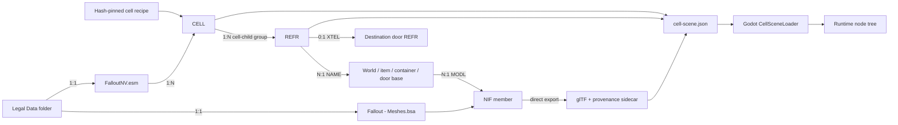
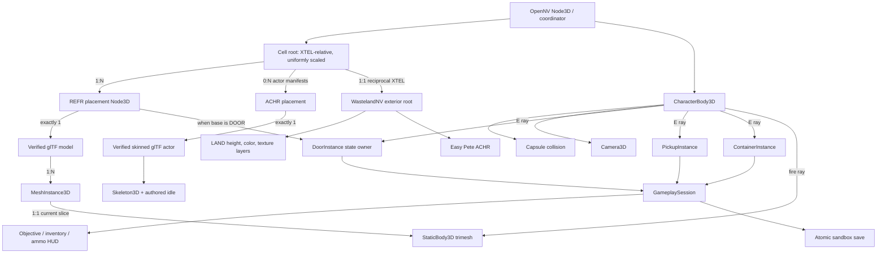
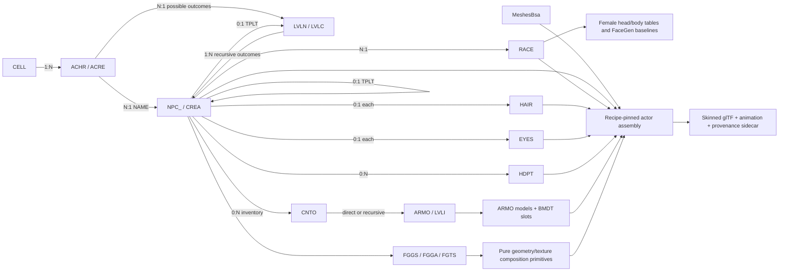
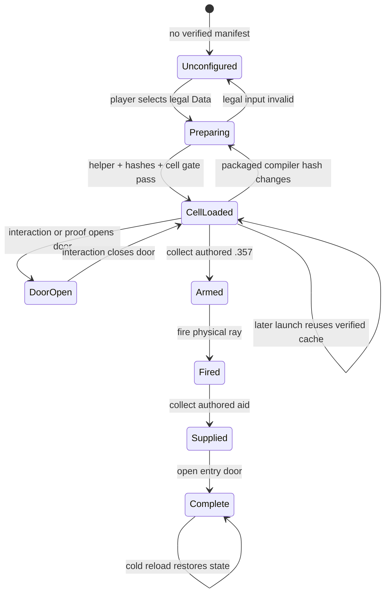
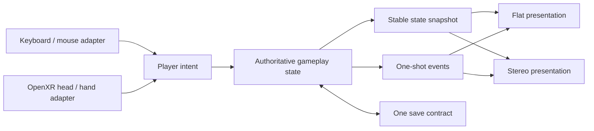

# OpenNV architecture and code accountability

Status: **playable experimental Goodsprings sandbox; not a full campaign**.

OpenNV is a clean first-party runtime. The retail installation is a read-only
input, the generated cache is disposable, every cross-boundary artifact has a
schema and hashes, and no OpenMW runtime or source code participates.
The executable-value rules, single configuration path, and source gate are
defined in [data and configuration accountability](data-and-configuration-accountability.md).
The official-stack actor/template/placement graph and exact meaning of a
whole-game visual pass are defined in
[whole-game actor and creature parity](whole-game-actor-creature-parity.md).
The official-stack CELL/child/portal denominator and exact meaning of a working
CELL are defined in [whole-game CELL parity](whole-game-cell-parity.md).

The actor data boundary is separate from model assembly and rendering:

`actor_catalog.py` owns these record relationships and preserves authored
placement/enable state; `facegen.py` owns only deterministic FaceGen math. This
keeps record parsing independent from the whole-game load-order/review corpus,
`prepare_actor.py`, which still resolves one hash-pinned compiled slice, and
`actor_gltf.py`, which owns only the skinned glTF,
material-flag, alpha, bind, and animation translation. None of those files
creates a Godot node or claims that a rendered actor matches retail.

## Runtime states

## First-class flat/VR boundary

VR is a product mode, not a later camera patch. Before the next gameplay system
is promoted, desktop and OpenXR must share one authoritative intent/state/event
path:

`CellPlayer` now constructs either a flat camera/input rig or a real OpenXR
origin, tracked head, left/right grip publishers, and left/right aim publishers
over the same `GameplaySession`. `DesktopInputMap` builds the keyboard/mouse
actions from the single runtime configuration; the XR action resource declares
the corresponding controller boundary. `GameplaySession` renders either its flat HUD or a
controller-mounted world-space HUD without duplicating inventory, objective, or
save rules. This remains bounded vertical-slice code; actor, combat, VATS, and
quest rules may not accumulate there. No unused VR manager, empty interface, or
speculative abstraction counts as progress.

The layout-only OpenXR gate proves the action map and required node hierarchy.
The repo-local simulator gate additionally proves both tracked retail hands,
both sticks, locomotion, HMD-pivot snap turn, data-derived door activation,
10mm fire/reload/save, supported eye height, wrist HUD, and native stereo
projection without Windows app control. The flat event-pipeline gate proves the
configured physical key/mouse bindings and the same gameplay outcomes. Promotion to
hardware-validated requires a real stereo run with head/two-controller poses,
room-scale collision, controller actions/haptics, identical route/save results,
and stereo-safe materials. Gameplay outcomes remain mode-independent; only
input translation and presentation differ.

The Saloon practice table follows this boundary. `PoolTableInstance` owns the
four recipe-pinned balls, authored reset state, pocket state, cue presentation,
and the single strike operation. `PoolBallInstance` is one hash-verified NIF
convex rigid body. Desktop look/power and tracked OpenXR cue-tip sweeps call the
same strike operation; `GameplaySession` serializes the resulting transforms,
velocities, and pocket state. The software gate requires an actual ball-to-ball
contact in both adapters. Physical headset pose, grip comfort, and haptics still
require a headset session.

## Source ownership

| File | Sole responsibility | Must not own |
| --- | --- | --- |
| `plugin_records.py` | Bounded TES4-family headers, groups, compression, subrecords | Cell or rendering semantics |
| `plugin_stack.py` | Master-aware stable FormIDs, official load-order mapping, and source identity | Actor, cell, or rendering semantics |
| `cell_catalog.py` | CELL, base, REFR, DATA, XTEL relationships | BSA/NIF/Godot behavior |
| `cell_parity_records.py` | Canonical CELL/child rows, source accounting, and effective override/deletion merge | Resource compilation, runtime streaming, or parity verdicts |
| `cell_parity_corpus.py` | Official-stack CELL graph, implicit-base/source-anomaly contracts, relationship closure, and complete pending review ledger | Runtime implementation or parity promotion |
| `validate_cell_parity_corpus.py` | Artifact hashes, raw/effective conservation, relationship closure, pending-state enforcement, and exact actor-placement join | Content compilation or visual approval |
| `corpus_io.py` | Deterministic atomic JSON/JSONL corpus artifacts and descriptors | Record or game semantics |
| `cell_compile_plan.py` | Natural CELL partitioning, exact child membership, deduplicated capability requirements, and absent-output scheduling | Content implementation, runtime nodes, or parity promotion |
| `validate_cell_compile_plan.py` | Source-corpus binding, partition hashes, exact job/child/capability coverage, and pending-state enforcement | Asset compilation or runtime claims |
| `cell_static_compile.py` | One planned CELL's content-addressed supported static assets, material contracts, placements, and explicit blockers | Godot nodes, gameplay, or parity promotion |
| `cell_static_contract.py` | Static CELL schemas, profile validation, coordinate policy, failure normalization, and producer-source closure | Archive reads, compilation, or Godot nodes |
| `cell_static_source.py` | Exact compile-job to corpus CELL/child/base/portal join | Asset conversion or runtime behavior |
| `validate_cell_static_compile.py` | Exact plan/corpus/archive/configuration join plus transform, material, nested-file, and filesystem-closure validation | Runtime loading or visual approval |
| `actor_catalog.py` | ACHR/ACRE, NPC_/CREA, TPLT/EAMT, LVLN/LVLC, RACE, HAIR, EYES, HDPT, ARMO, FaceGen and placement relationships | Mesh assembly or rendering |
| `actor_parity_graph.py` | Recursive category-source appearance variants and concrete leveled placement candidates | Binary parsing, capture, or rendering |
| `actor_parity_records.py` | Canonical actor rows and effective override/deletion merge | Template traversal, capture, or rendering |
| `actor_parity_corpus.py` | Official-stack composition and complete private review-ledger generation | Actor-specific fixes or parity verdicts |
| `validate_actor_parity_corpus.py` | Corpus hashes, uniqueness, graph closure, and exact review coverage | Rendering or automatic visual approval |
| `actor_capture_plan.py` | Exact review-ledger projection into resumable fixed/dynamic base observation jobs | Launching engines or claiming visual parity |
| `validate_actor_capture_plan.py` | Capture-plan hashes, source-stack join, batch membership, and exact outcome coverage | Image comparison or changing evidence status |
| `actor_review_contract.py` | One classified review row joined to immutable retail frames, final-eye D3D9 projection, animation, hierarchy, and skin-palette evidence | Owned-asset compilation or parity verdicts |
| `prepare_creature_review.py` | One CREA review contract compiled from the owned official archive stack into a disposable generic actor-review scene | Retail capture, Godot runtime behavior, or comparison verdicts |
| `actor_review_differential.py` | Exact retail/Godot sample pairing, hash verification, objective image/structure gates, side-by-side stills, retail-timed motion clip, and one fail-closed ledger row | Importing assets, altering capture state, or human approval |
| `actor_review_coverage.py` | Exhaustive join of every corpus appearance and placement to unique differential evidence with aggregate missing/failed/unreviewed counts | Sampling, visual approval, or changing evidence verdicts |
| `facegen.py` | Pure EGM/EGT morph and retail skin/body texture composition primitives | Record selection or runtime nodes |
| `actor_gltf.py` | One actor skeleton/skin/mesh/idle assembly to glTF plus provenance and stable per-surface runtime identities, with an explicit gate against silently omitted render geometry | Record selection, placement, particle simulation, or runtime behavior |
| `first_person_rig.py` | Hash-verified legal left/right first-person hand artifacts plus skeleton/pose/frame contract | Runtime tracking or weapon behavior |
| `actor_material.py` | Bethesda actor shader, tint, vertex-color, specular, and alpha flag translation | Geometry, records, or runtime lighting |
| `prepare_actor.py` | Hash-pinned retail actor recipe resolution and atomic disposable cache output | Godot loading or parity verdicts |
| `bsa_archive.py` | Indexed BSA v104 member lookup and extraction | Record or scene semantics |
| `export_static_nif_gltf.py` | NIF static geometry, winding/stencil culling metadata, glTF, and provenance | World placement or gameplay |
| `havok_collision_gltf.py` | Bounded authored packed triangles plus convex/list dynamic body, shape, mass, friction, bounce, damping and filter export | Runtime body policy or unsupported shape guessing |
| `gltf_io.py` | Deterministic buffer/accessor packing and atomic glTF artifact writes | NIF, LAND, actor, or gameplay semantics |
| `cell_scene.py` | Recipe selection, XTEL origin, full Gamebryo-to-Godot transform/scale conversion, asset/reference/material manifest | Godot nodes or input |
| `material_contract.py` | Shared NIF-surface to runtime material binding translation | Mesh export, archive lookup, or Godot resources |
| `scene_asset_pipeline.py` | Shared bounded-scene NIF extraction, interactions, and data-resolved loadout artifacts | CELL selection or Godot nodes |
| `exterior_scene.py` | Bounded grid/persistent reference selection, reciprocal XTEL and exterior manifest | LAND decoding or runtime nodes |
| `landscape_catalog.py` | LAND ownership, height/normal/color, LTEX/TXST and quadrant-layer contracts | Godot nodes or weather |
| `landscape_gltf.py` | One LAND grid plus deterministic owned-texture layer bake and provenance | CELL selection or runtime physics |
| `texture_pipeline.py` | Embedded-name texture-BSA lookup and DDS-to-PNG cache | Runtime material policy |
| `prepare_legal_assets.py` | Legal-input validation and atomic cache transaction | Rendering |
| `goodsprings-saloon-structure-v1.json` | Exact proof target, hash, selection, entry, scale | Parsing logic |
| `goodsprings-trudy-actor-v1.json` | Exact retail master/archives, ACHR, and CELL identity | Appearance guesses or rendering logic |
| `runtime/config/open-nv-runtime-v1.json` | Single versioned non-retail policy boundary with provenance and parity status | Fallout-authored placement, identity, or item stats |
| `runtime_configuration.py` / `RuntimeConfiguration.cs` | Strict typed load, validation, and SHA-256 identity for that boundary | Feature behavior |
| `validate_runtime_report.py` | Join runtime proof reports to owned-data manifests and configuration | Rendering or gameplay implementation |
| `audit_source_constants.py` | Production Python/C#/JavaScript/PowerShell literal accountability gate | Runtime defaults or content policy |
| `test_cell_catalog.py` | Synthetic group/relationship/transform regressions | Retail bytes |
| `test_cell_parity_corpus.py` | Synthetic official-stack merge, deletion, portal, implicit-base, source-anomaly, conservation, and actor-join regressions | Retail bytes or runtime claims |
| `test_cell_compile_plan.py` | Synthetic CELL job, partition, child, capability-set, and source-anomaly assignment regressions | Asset compilation or readiness claims |
| `test_actor_catalog.py` | Synthetic actor identity/appearance/placement graph regressions | Mesh or renderer assertions |
| `test_facegen.py` | Synthetic geometry, texture-mode, skin, and body composition regressions | Retail actor selection |
| `test_actor_gltf.py` | Bethesda material, alpha, vertex-color, and non-accumulating idle translation regressions | Retail visual approval |
| `test_static_nif_gltf.py` | Synthetic BSA/NIF geometry regressions | Runtime orchestration |
| `OpenNV.Content.spec` | One-file helper inputs and packaged recipe/data files | Content semantics |
| `LegalAssetPreparer.cs` | Packaged-helper process and cache/compiler validation | Record parsing |
| `VerifiedGltfLoader.cs` | Sidecar/model/buffer hash verification and glTF load | Cell placement |
| `CellContentLoader.cs` | One verified CELL presentation/entity root with authored collision instances | Binary parsing or player ownership |
| `CellSceneLoader.cs` | Shared session/view composition, linked CELL alignment, reciprocal portal and proof queries | Binary parsing |
| `RuntimeMaterialLoader.cs` | Hash-verified 2D/cubemap load and name-keyed retail material passes | DDS/BSA parsing |
| `StaticCellCompileArtifact.cs` | Static compile schema/configuration/hash/path/count verification and immutable row load | Godot node construction |
| `StaticCellCompileLoader.cs` | Verified relative artifact load, static placement instantiation, CELL lighting, and authored collision | Record parsing, actors, gameplay, or parity claims |
| `ActorModelSlice.cs` | Hash-verified skinned glTF import, idle start, and non-accumulating bounds contract | Record parsing or placement |
| `CellActorLoader.cs` | Actor-manifest identity, CELL ownership, enable-state gate, and ACHR placement | Actor export or AI state simulation |
| `RetailActorStateContract.cs` | Fail-closed retail shot-state parsing for ACHR transform, camera, idle phase, arm bones, and face/hair hashes | Process addresses, asset parsing, or rendering |
| `EnvironmentCapture.cs` | Native cell/actor frames, application of validated retail shot state, normalized telemetry, hashes, and visual-quality gates | Gameplay or desktop control |
| `actor_parity.py` | Retail/Godot identity, camera, pixel metrics, and labelled differential sheets | Rendering or automatic human approval |
| `DoorInstance.cs` | One door's closed/open transform state | Input or global registry |
| `PickupInstance.cs` | One authored pickup's identity and weapon profile | Inventory ownership |
| `ContainerInstance.cs` | One authored container's resolved content contract | Session persistence |
| `PoolBallInstance.cs` | One authored dynamic convex body and its persisted motion/pocket state | Table rules or input |
| `PoolTableInstance.cs` | One table assembly, cue presentation, shared strike/reset/pocket behavior, and ball ownership | Input polling or asset parsing |
| `GameplaySession.cs` | Objective, HUD, inventory, ammo, world delta, pool snapshots, save/reload | Asset parsing |
| `CellPlayer.cs` | Shared collision body plus flat/OpenXR view, movement, activation, firing, and pool-input adapters | Asset preparation or gameplay outcomes |
| `DesktopInputMap.cs` | Configured physical key/mouse events to named Godot actions | Gameplay decisions or Windows input injection |
| `FirstPersonRig.cs` | Verified hand import and retail Camera1st/Weapon/grip-frame alignment | Content extraction or controller polling |
| `PlayerControlTelemetry.cs` | Simulator-only pose, locomotion, floor-height, snap-pivot, and action acceptance measurements | Input synthesis or gameplay mutation |
| `XrSimulatorAcceptance.cs` | Time-bounded simulator observation and evidence report for tracked hands, sticks, locomotion, interactions, weapon, save, and floor height | Input synthesis or headset claims |
| `FlatControlsAcceptance.cs` | Configured Godot keyboard/mouse event acceptance over the shared gameplay path | Windows input injection or gameplay rules |
| `XrRigLayoutAcceptance.cs` | Headless OpenXR action-map, node hierarchy, HUD, and shared weapon-state layout gate | Simulator or headset claims |
| `RuntimeCoordinator.cs` | Startup option routing, composition, shared report writing, and shutdown ownership | Feature-specific acceptance logic, UI construction, or file-format parsing |
| `LegalAssetSetupView.cs` | First-run folder selection and status UI | Preparation or rendering |
| `StaticModelSlice.cs` | Legacy one-model proof view | Cell relationships |
| `main.tscn` | One composition root bound to the coordinator | Dynamic entity data |
| `runtime-manifest.json` | Launcher-visible capabilities and executable contract | Promotion claims beyond gates |
| `Test-GodotRuntime.ps1` | Source, synthetic, retail-opt-in, format, and analyzer gates | Packaging state |
| `Test-OpenXrSimulatorControls.ps1` | Isolated simulator launch, binding-path input drive, native projection, and evidence hashes | Headset claims or Windows app control |
| `Test-OpenNVStaticCellSlice.ps1` | Immutable owned-data compile, independent validation, Godot load, and report-to-manifest join | Visual parity or playable-campaign claims |
| `Build-ContentTool.ps1` | Helper packaging, CLI smoke, and license collection | Runtime behavior |
| `Build-GodotRuntime.ps1` | Clean export, first/reuse proof, notice and asset-free ZIP gates | Gameplay logic |
| `desktop/src/*` | Cross-platform campaign/launch shell | Asset parsing or rendering |
| `site/*` | Static public status and product identity | Runtime capability decisions |

Tests mirror those boundaries: synthetic plugin graph tests cover parsing and
relationships; synthetic NIF tests cover deterministic geometry; Godot reports
cover node counts, floor placement, collision, door traversal, objective
completion, save, and cold reload. Build scripts
package only a clean commit, refuse overwrites, scan for commercial extensions,
and exercise first-run plus cache-reuse routes when legal data is supplied.

## Current truth and deliberate gaps

Implemented: direct owned ESM/BSA/NIF/DDS/LAND path, XTEL-derived spawn, 504
enabled interior/exterior references, 228 visible/held/terrain assets, 379 textures, 476
materials, 97 saloon pickups, five containers, 27 authored lights, full converted item rotations,
supported authored packed-triangle collision,
movement, configured flat input, HUD, inventory, authored `.357` and 10mm
damage/clip data, firing/reload, objectives,
doors, atomic save, cold reload, and launcher-enabled sandbox play.
The saloon door `0010618e` and exterior door `0010636f` are a reciprocal pair.
Their visible planes align below `0.000001` metre, both states persist together,
and the gate passes closed collision, open fire-ray clearance, and two-way player
capsule traversal. The linked exterior includes LAND `000db010`; Sunny Smiles
and the settler load inside while Easy Pete loads outside from their ACHRs.
The OpenXR software path adds Oculus Touch plus OpenXR generic-controller maps,
`XROrigin3D`, distinct grip/aim publishers, two skinned owned-data retail hands,
the retail `Weapon`-frame 10mm mount, metre scale, 90 Hz physics, locomotion,
HMD-pivot snap turn, controller activation/fire/reload/save, haptics, world-space
HUD, supported-floor eye-height calibration, simulator acceptance, and explicit
launcher routing. `hardwareHeadsetValidated` remains false.

Implemented: master-aware official load-order identity, effective override and
deletion merge, recursive humanoid/creature template and leveled-list
relationships, complete private review ledgers, deterministic FaceGen
geometry/texture primitives, and a hash-verified one-to-many Goodsprings actor
cache. The
ordinary legal installer prepares the world actor set and loads the authored
enabled Goodsprings settler, Sunny Smiles, and exterior Easy Pete at their ACHR
placements. Initially disabled Trudy remains out
of normal gameplay until quest/enable state is implemented; an explicit proof
override is still required for her comparison lane. Cache generation and import
are not fidelity claims. Whole-game corpus validation proves inventory coverage,
not visual parity. The capture lane can consume a compact retail state contract and
apply each shot's live ACHR placement, camera/aim, vertical FOV, and `mtidle`
phase. Projection remains explicitly provisional; current framing evidence
favors 59.840 degrees vertical by interpreting retail 75 degrees at the 4:3
reference aspect, until a render-pass world projection is recovered. Production still needs
quest/enable-parent/package state before an initially disabled actor can appear
naturally.

The latest private differential applies Trudy plus the authored seated
Goodsprings settler in both shots. Identity, placement, yaw, camera, animation
phase, and all 56 deform-bone world transforms pass for both actors; worst bone
translation is below `0.000002` metres. Rendering remains a hard failure at
portrait/full-body MAE `0.0790`/`0.0811` and changed-pixel fractions
`75.9%`/`86.4%`. The remaining visual gap is not a camera, placement, or pose
excuse.

The cell transform boundary negates Gamebryo yaw when producing Godot Y rotation:
retail forward is `(sin(yaw), cos(yaw))`, while Godot positive Y rotation has the
opposite sign. Cell scene v7 and actor scene v3 make that correction explicit,
carry decoded alpha/vertex/emission/cubemap state, and hash the complete actor
artifact chain. Runtime culling now follows each NIF's
`NiStencilProperty`; the former recipe-wide double-sided override is removed.

Not implemented: environment-map light fade and external-emittance color, Havok
shape families beyond packed triangles and convex/list dynamics, broad filter policy, SpeedTree vegetation, neighboring exterior
streaming, retail weather/time, complete first-person body/weapon animation
blending beyond the current retail pose sample, damageable actors/creatures, VATS, or full
campaigns. There are no placeholder managers for
these. Each enters only with a data contract, synthetic test, retail proof, and
promotion gate.

The current screenshots are **not** a retail-fidelity claim. The decoded alpha,
self-illum, six-face cubemap, name-keyed surface, and CELL depth-fog paths are
implemented, but external emittance, environment light fade, the full retail
lighting/HDR path, complete Havok behavior, and actor pixels remain open
differential gates. The clean-room shader observations are recorded in
`docs/evidence/fnv-retail-material-shader-contract.md`.

Next promotion order:

1. partition the whole-game corpus into fail-closed per-CELL compile jobs and a
   capability ledger;
2. generalize owned-data compilation and streaming across representative
   interior, exterior, LAND, NAVM, actor, and XTEL classes;
3. close fixed-camera material, lighting, weather, effect, and actor-pixel gates;
4. package the same streamed route and rerun physical OpenXR acceptance;
5. promote authored packages/dialogue plus jukebox interaction/audio;
6. extend Havok body/filter/dynamic behavior beyond the promoted pool slice;
7. add damageable targets, authored flat/VR weapon presentation,
   ballistics/projectiles,
   creatures and raiders; and
8. promote VATS only after the same combat route passes deterministic recording,
   flat/VR presentation, and cold-reload gates.

The asset distribution follows the four-surface model described in
[Shipping an asset-free Godot XR port](https://github.com/Brobert-in-aus/guides/blob/main/vr/shipping-an-asset-free-godot-xr-port.md): public source, asset-free build,
user-owned game data, and private identity material remain separately auditable.
OpenNV does not use the guide's native-ABI shortcut because no lawful,
cross-platform New Vegas simulation library is available to embed. See the
retained retail evidence in
[fnv-esm-cell-contract.md](evidence/fnv-esm-cell-contract.md) and the explicit
[OpenXR runtime contract](evidence/openxr-runtime-contract.md). The promoted
interior/exterior boundary is recorded in the
[Goodsprings linked-world contract](evidence/fnv-goodsprings-linked-world-contract.md).
