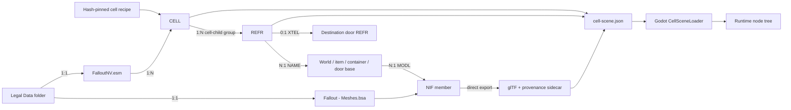
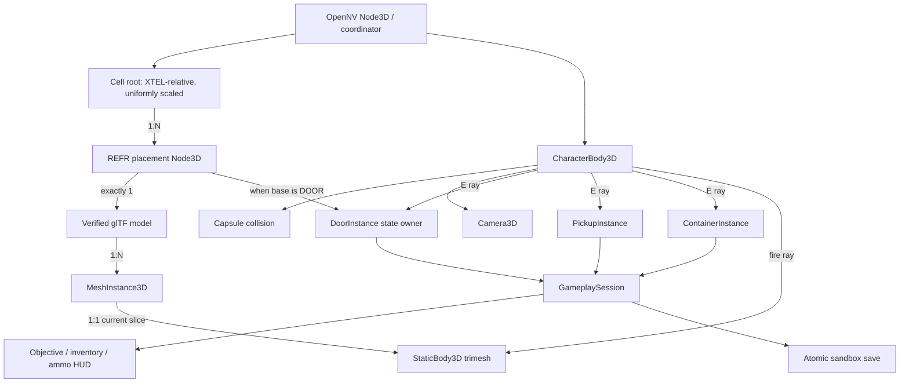
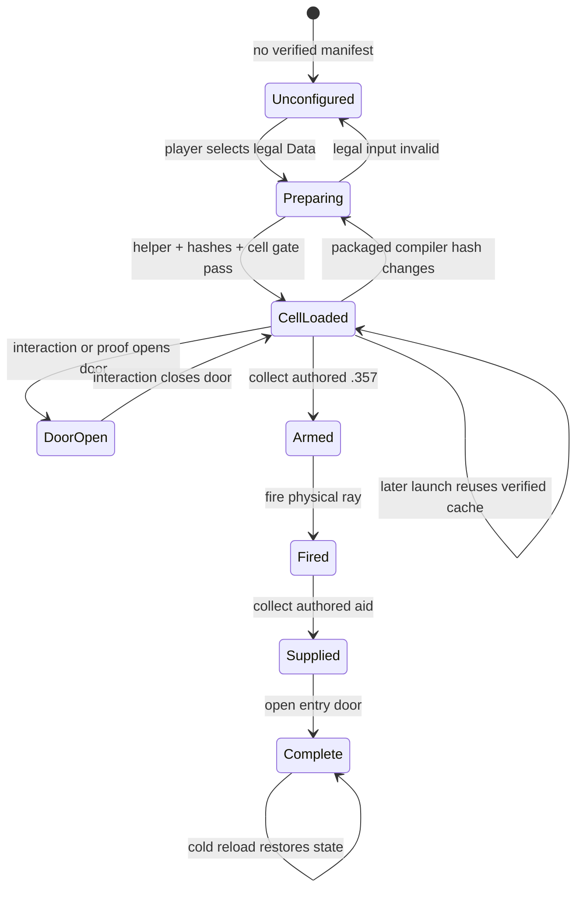
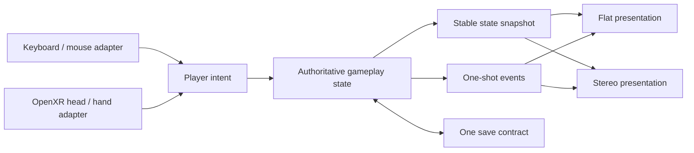

# OpenNV architecture and code accountability

Status: **playable experimental Goodsprings sandbox; not a full campaign**.

OpenNV is a clean first-party runtime. The retail installation is a read-only
input, the generated cache is disposable, every cross-boundary artifact has a
schema and hashes, and no OpenMW runtime or source code participates.

## Runtime states

## First-class flat/VR boundary

VR is a product mode, not a later camera patch. Before the next gameplay system
is promoted, desktop and OpenXR must share one authoritative intent/state/event
path:

The current `CellPlayer` desktop input and `GameplaySession` screen-space HUD are
temporary vertical-slice code, not the final cross-mode boundary. They may not
accumulate actor, combat, VATS, or quest rules. The first OpenXR promotion must
replace that coupling with code exercised by both modes; no unused VR manager,
empty interface, or speculative abstraction counts as progress.

The OpenXR gate requires a real stereo run, head and two-controller pose input,
metre-correct world scale, world-space interaction/HUD, identical scripted
gameplay reports and save state between flat and VR adapters, and stereo-safe
materials. Gameplay outcomes remain mode-independent; only input translation
and presentation differ.

## Source ownership

| File | Sole responsibility | Must not own |
| --- | --- | --- |
| `plugin_records.py` | Bounded TES4-family headers, groups, compression, subrecords | Cell or rendering semantics |
| `cell_catalog.py` | CELL, base, REFR, DATA, XTEL relationships | BSA/NIF/Godot behavior |
| `bsa_archive.py` | Indexed BSA v104 member lookup and extraction | Record or scene semantics |
| `export_static_nif_gltf.py` | NIF static geometry to glTF plus provenance | World placement or gameplay |
| `cell_scene.py` | Recipe selection, XTEL origin, asset/reference/material manifest | Godot nodes or input |
| `texture_pipeline.py` | Embedded-name texture-BSA lookup and DDS-to-PNG cache | Runtime material policy |
| `prepare_legal_assets.py` | Legal-input validation and atomic cache transaction | Rendering |
| `goodsprings-saloon-structure-v1.json` | Exact proof target, hash, selection, entry, scale | Parsing logic |
| `test_cell_catalog.py` | Synthetic group/relationship/transform regressions | Retail bytes |
| `test_static_nif_gltf.py` | Synthetic BSA/NIF geometry regressions | Runtime orchestration |
| `OpenNV.Content.spec` | One-file helper inputs and packaged recipe/data files | Content semantics |
| `LegalAssetPreparer.cs` | Packaged-helper process and cache/compiler validation | Record parsing |
| `VerifiedGltfLoader.cs` | Sidecar/model/buffer hash verification and glTF load | Cell placement |
| `CellSceneLoader.cs` | Manifest-to-node graph, placement, collision, proof queries | Binary parsing |
| `RuntimeMaterialLoader.cs` | PNG hash validation and surface material construction | DDS/BSA parsing |
| `EnvironmentCapture.cs` | Actor-free native frames, hashes, and visual-quality gates | Gameplay or desktop control |
| `DoorInstance.cs` | One door's closed/open transform state | Input or global registry |
| `PickupInstance.cs` | One authored pickup's identity and weapon profile | Inventory ownership |
| `ContainerInstance.cs` | One authored container's resolved content contract | Session persistence |
| `GameplaySession.cs` | Objective, HUD, inventory, ammo, world delta, save/reload | Asset parsing |
| `CellPlayer.cs` | Movement, view, activation and firing input | Asset preparation |
| `RuntimeCoordinator.cs` | Startup routing, reports, and gate orchestration | UI construction or file-format parsing |
| `LegalAssetSetupView.cs` | First-run folder selection and status UI | Preparation or rendering |
| `StaticModelSlice.cs` | Legacy one-model proof view | Cell relationships |
| `main.tscn` | One composition root bound to the coordinator | Dynamic entity data |
| `runtime-manifest.json` | Launcher-visible capabilities and executable contract | Promotion claims beyond gates |
| `Test-GodotRuntime.ps1` | Source, synthetic, retail-opt-in, format, and analyzer gates | Packaging state |
| `Build-ContentTool.ps1` | Helper packaging, CLI smoke, and license collection | Runtime behavior |
| `Build-GodotRuntime.ps1` | Clean export, first/reuse proof, notice and asset-free ZIP gates | Gameplay logic |
| `desktop/src/*` | Cross-platform campaign/launch shell | Asset parsing or rendering |
| `site/*` | Static public status and product identity | Runtime capability decisions |

Tests mirror those boundaries: synthetic plugin graph tests cover parsing and
relationships; synthetic NIF tests cover deterministic geometry; Godot reports
cover node counts, floor placement, collision, door traversal, objective
completion, save, and cold reload. Build scripts
package only a clean commit, refuse overwrites, scan for commercial extensions,
and exercise first-run plus cache-reuse routes when legal data is supplied.

## Current truth and deliberate gaps

Implemented: direct owned ESM/BSA/NIF/DDS path, XTEL-derived spawn, 348 saloon
references, 153 visible assets, 255 textures, 332 materials, 97 pickups, five
containers, 24 authored lights, full converted item rotations, collision,
movement, HUD, inventory, authored `.357` damage/clip data, firing, objectives,
doors, atomic save, cold reload, and launcher-enabled sandbox play.

Not implemented: full Bethesda environment/mask material semantics, authored
bhk collision, non-item arbitrary rotation promotion, visible first-person
weapon animation, damageable actors/creatures, VATS, exterior streaming, or full
campaigns. There are no placeholder managers for
these. Each enters only with a data contract, synthetic test, retail proof, and
promotion gate.

The current screenshots are **not** a retail-fidelity claim. Environment/mask
shader semantics, alpha/effect paths, fog and light calibration, authored Havok
collision, and all actor rendering remain open differential gates.

Next promotion order:

1. close and package this playable saloon route;
2. promote the shared desktop/OpenXR intent, state, event, scale, and save
   boundary through a real OpenXR rig;
3. promote Trudy as one complete `ACHR -> NPC_ -> RACE/body/clothing/FaceGen ->
   skeleton -> idle` actor, with no proxy mesh or generated substitute;
4. run fixed-camera retail/Godot interior differentials for materials, lighting,
   effects, and collision until the saloon reaches its visual gate;
5. add damageable targets, authored flat/VR weapon presentation,
   ballistics/projectiles,
   creatures and raiders; and
6. promote VATS only after the same combat route passes deterministic recording,
   flat/VR presentation, and cold-reload gates.

The asset distribution follows the four-surface model described in
[Shipping an asset-free Godot XR port](https://github.com/Brobert-in-aus/guides/blob/main/vr/shipping-an-asset-free-godot-xr-port.md): public source, asset-free build,
user-owned game data, and private identity material remain separately auditable.
OpenNV does not use the guide's native-ABI shortcut because no lawful,
cross-platform New Vegas simulation library is available to embed. See the
retained retail evidence in
[fnv-esm-cell-contract.md](evidence/fnv-esm-cell-contract.md).
