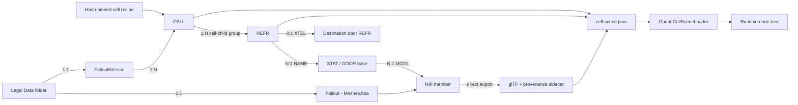
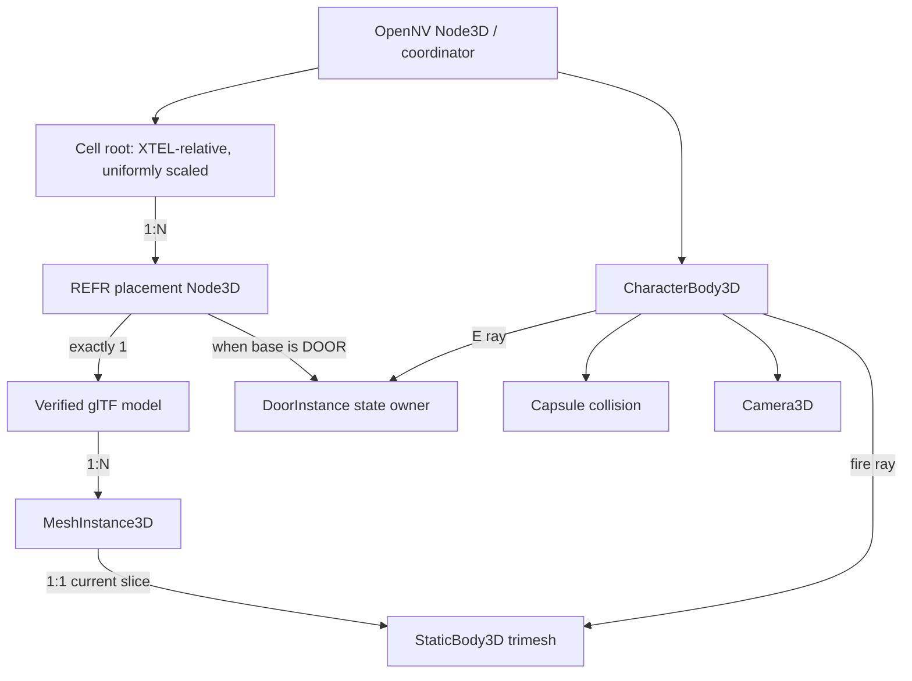
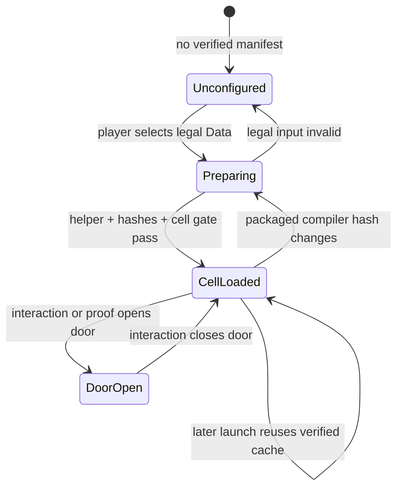

# OpenNV architecture and code accountability

Status: **experimental Godot cell slice; not a playable campaign**.

OpenNV is a clean first-party runtime. The retail installation is a read-only
input, the generated cache is disposable, every cross-boundary artifact has a
schema and hashes, and no OpenMW runtime or source code participates.

## Runtime states

## Source ownership

| File | Sole responsibility | Must not own |
| --- | --- | --- |
| `plugin_records.py` | Bounded TES4-family headers, groups, compression, subrecords | Cell or rendering semantics |
| `cell_catalog.py` | CELL, base, REFR, DATA, XTEL relationships | BSA/NIF/Godot behavior |
| `bsa_archive.py` | Indexed BSA v104 member lookup and extraction | Record or scene semantics |
| `export_static_nif_gltf.py` | NIF static geometry to glTF plus provenance | World placement or gameplay |
| `cell_scene.py` | Recipe selection, XTEL origin, asset/reference manifest | Godot nodes or input |
| `prepare_legal_assets.py` | Legal-input validation and atomic cache transaction | Rendering |
| `goodsprings-saloon-structure-v1.json` | Exact proof target, hash, selection, entry, scale | Parsing logic |
| `test_cell_catalog.py` | Synthetic group/relationship/transform regressions | Retail bytes |
| `test_static_nif_gltf.py` | Synthetic BSA/NIF geometry regressions | Runtime orchestration |
| `OpenNV.Content.spec` | One-file helper inputs and packaged recipe/data files | Content semantics |
| `LegalAssetPreparer.cs` | Packaged-helper process and cache/compiler validation | Record parsing |
| `VerifiedGltfLoader.cs` | Sidecar/model/buffer hash verification and glTF load | Cell placement |
| `CellSceneLoader.cs` | Manifest-to-node graph, placement, collision, proof queries | Binary parsing |
| `DoorInstance.cs` | One door's closed/open transform state | Input or global registry |
| `CellPlayer.cs` | Movement, view, interaction ray, projectile ray | Asset preparation |
| `RuntimeCoordinator.cs` | Startup routing, reports, and gate orchestration | UI construction or file-format parsing |
| `LegalAssetSetupView.cs` | First-run folder selection and status UI | Preparation or rendering |
| `StaticModelSlice.cs` | Legacy one-model proof view | Cell relationships |
| `main.tscn` | One composition root bound to the coordinator | Dynamic entity data |
| `runtime-manifest.json` | Launcher-visible capabilities and executable contract | Promotion claims beyond gates |
| `Test-GodotRuntime.ps1` | Source, synthetic, retail-opt-in, format, and analyzer gates | Packaging state |
| `Build-ContentTool.ps1` | Helper packaging, CLI smoke, and license collection | Runtime behavior |
| `Build-GodotRuntime.ps1` | Clean export, first/reuse proof, notice and asset-free ZIP gates | Gameplay logic |
| `desktop/src/*` | Cross-platform campaign/launch shell | Asset parsing or rendering |
| `site/*` | Static public status and product identity | Runtime capability decisions |

Tests mirror those boundaries: synthetic plugin graph tests cover parsing and
relationships; synthetic NIF tests cover deterministic geometry; Godot reports
cover node counts, floor placement, collision, and door traversal. Build scripts
package only a clean commit, refuse overwrites, scan for commercial extensions,
and exercise first-run plus cache-reuse routes when legal data is supplied.

## Current truth and deliberate gaps

Implemented: direct owned ESM/BSA/NIF path, XTEL-derived spawn, 42 saloon
structural references, collision, walking, mouse-look, interactive doors,
physical ray queries, and whole-cell visibility without fake portal planes.

Not implemented: DDS textures, full Bethesda materials, authored bhk collision,
general X/Y reference rotation, animation, actors/creatures, weapons, VATS,
saves, exterior streaming, or campaigns. There are no placeholder managers for
these. Each enters only with a data contract, synthetic test, retail proof, and
promotion gate.

Next order: DDS/material fidelity, authored collision, generalized cell recipes,
then actors/combat and VATS recording. See the retained retail evidence in
[fnv-esm-cell-contract.md](evidence/fnv-esm-cell-contract.md).
