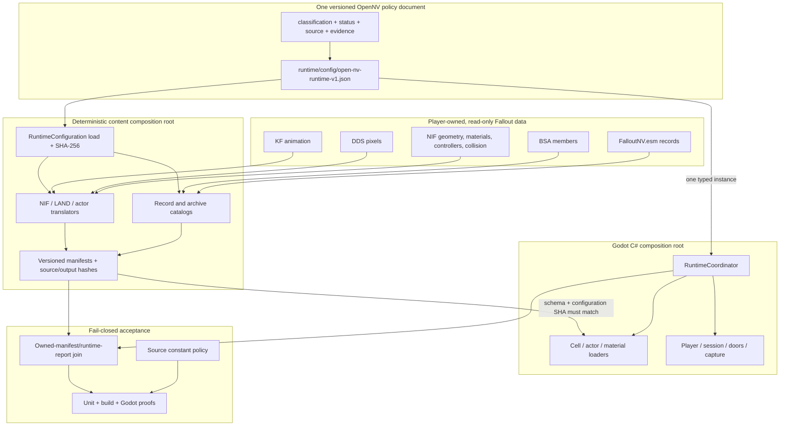
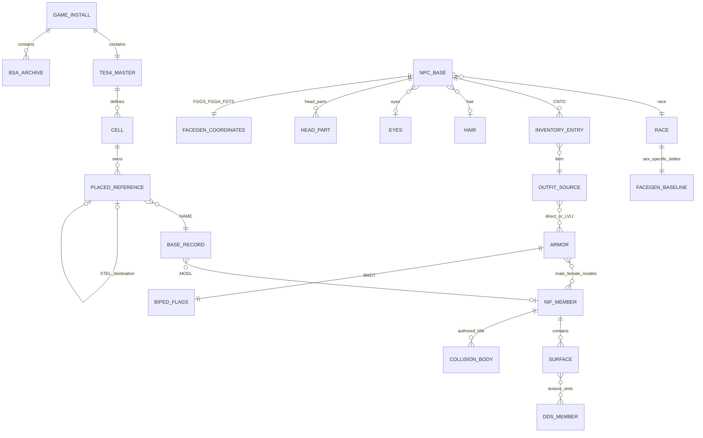

# OpenNV data and configuration accountability

Status: **enforced for all first-party executable C#, Python, JavaScript, and
PowerShell, with unsupported source-language detection**.

OpenNV has one rule for every meaningful value: it is either authored Fallout
data, an immutable external-format or mathematical contract, or an explicitly
named OpenNV policy in
`runtime/config/open-nv-runtime-v1.json`. A value cannot silently fall through
to a guessed runtime default.

## The four allowed value classes

| Class | Location | Examples | Rule |
| --- | --- | --- | --- |
| Fallout-authored data | ESM/BSA/NIF/DDS/KF and generated manifests | ACHR position/rotation/XSCL, WEAP damage/clip/ammo, XTEL destination, CNTO/LVLI outfit graph, BMDT hair slot, NIF material flags, XCLL lighting | Parse and preserve it; never replace it with recipe or runtime guesses. |
| OpenNV policy | `runtime/config/open-nv-runtime-v1.json` | player dimensions, XR comfort settings, renderer adapter, diagnostic thresholds, compiler sampling/output policy | Give it provenance and a status, validate it, inject it at a composition root, and hash it into compiled content. |
| External format contract | named module constants | BSA v104 layout, DDS header offsets, glTF component enums, NIF alpha bit fields, FaceGen header sizes | Name it after the external standard. It is not user-tunable configuration; changing it changes how bytes are decoded. |
| Mathematical identity | deliberately tiny literal allow-list | zero/one, vector dimensions, matrix indexing, sign changes | Only `-4..4` are accepted inline. Anything larger or fractional must be named or configured. |

Tests may contain synthetic fixture bytes and expected values. Recipes and the
runtime JSON are data/configuration, not executable code. Generated caches,
images, binaries, and third-party sources are outside the source-literal scan.
Godot resources, package/workflow manifests, HTML, and CSS are declarative
configuration surfaces rather than executable behavior. The gate inventories
those files, forbids project-level viewport/clear-color copies of injected
runtime policy, and fails if a new executable file type appears in a production
source directory without a scanner.

## Owned-data entity graph

This graph is why actor assembly is not a list of hand-picked meshes. An ACHR
resolves to its NPC_, race, FaceGen coordinates, inventory, recursive LVLI
entries, ARMO models, and BMDT hair visibility. A CELL reference resolves to a
base record and its model; runtime node creation consumes that manifest rather
than inventing placements.

## Single injection path

The C# runtime loads exactly one typed `RuntimeConfiguration` in
`RuntimeCoordinator`. The coordinator passes that instance to every loader,
player, session, capture, preview, and setup owner. JSON deserialization rejects
unknown top-level properties. Prepared cell and actor manifests carry the
configuration schema and SHA-256; loaders reject a cache made with any other
configuration.

The Python content composition roots load the same bytes and pass typed
`ContentCompilerConfiguration` values into actor, static-NIF, texture, and LAND
export. There is one NIF roughness translation for actors, static glTF, and
runtime material bindings. Build scripts do not repeat retail weapon stats or
coverage totals: `validate_runtime_report.py` joins reports back to the actual
owned-data manifests and this configuration.

## Configuration ownership

| Section | Owner and present truth |
| --- | --- |
| `world` | Verified Gamebryo world-unit conversion. |
| `simulation`, `player`, `xr`, `hud` | Explicit OpenNV flat/VR policy; hardware or playtest gated where stated. |
| `renderer` | Honest parity-failing Godot adapter; raw authored XCLL/material inputs remain available. |
| `door` | Provisional fallback angle until NIF controller tracks are evaluated. |
| `capture`, `proof`, `retailActorState`, `actorParity` | Diagnostic-only gates, never world or actor authoring data. |
| `diagnosticPreview`, `setupView` | Diagnostic/setup presentation only. |
| `desktopLauncher` | Independently packaged launcher boot-window and notification presentation, copied from this same file at package time. |
| `exteriorEnvironment` | Honest parity-failing clear-day adapter until climate/weather/time evaluation exists. |
| `legalAssets` | Asset-free local-import/cache policy. |
| `contentCompiler` | Deterministic output, animation sampling, material adapter, and bounded LAND bake policy. Material/LAND fidelity remains parity-failing. |
| `actorCompiler` | Explicitly parity-failing unresolved idle/package, skin-tone, and body-alias state. It is not represented as Fallout-authored truth. |

## Enforcement and promotion

`scripts/audit_source_constants.py` parses Python AST (including the packaging
spec, hook, and the audit itself) and scans non-string code tokens in C#,
JavaScript, and PowerShell. Production literals outside the tiny mathematical
allow-list fail unless they are named compile-time contracts. Its own language
scanners and the Godot bootstrap-duplication check have unit tests. The pass
line reports audited source-file, source-line, and declarative-configuration
counts. `Test-GodotRuntime.ps1` runs this gate, so release CI and packaging
inherit it.

The policy is necessary but not sufficient. Promotion also requires:

1. all unit tests and C# build/format checks;
2. a fresh, non-overwritten cache from a hash-pinned legal install;
3. manifest/configuration hash agreement;
4. exact runtime counts derived from those manifests, not copied numbers;
5. reciprocal XTEL, authored floor collision, closed/open projectile checks,
   and two-way capsule traversal;
6. retail/Godot matched-state telemetry and visual review for fidelity claims.

Current deliberate failures remain visible in configuration provenance. A
green constant gate does not mean retail renderer, actor package/idle state,
door controllers, weather, VATS, or full campaign behavior are complete.
