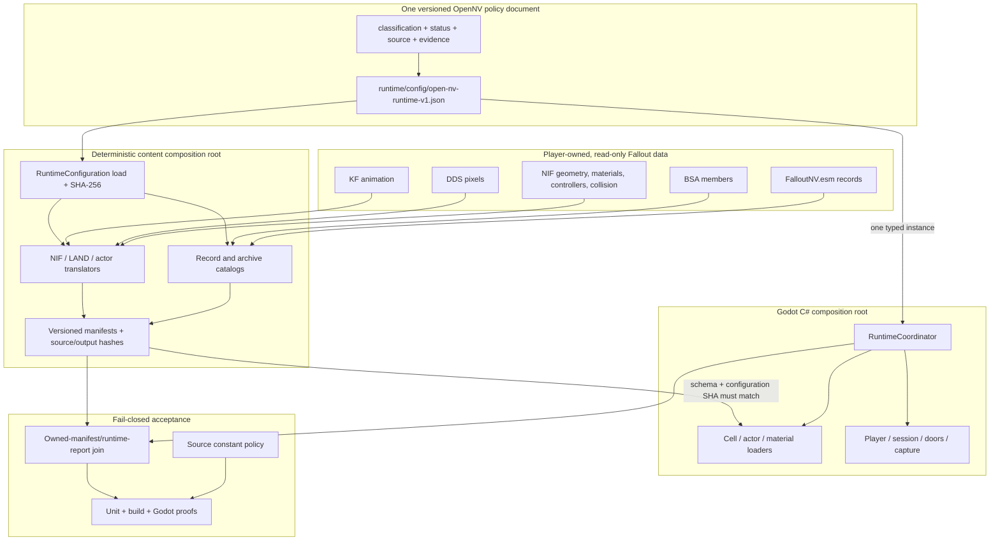
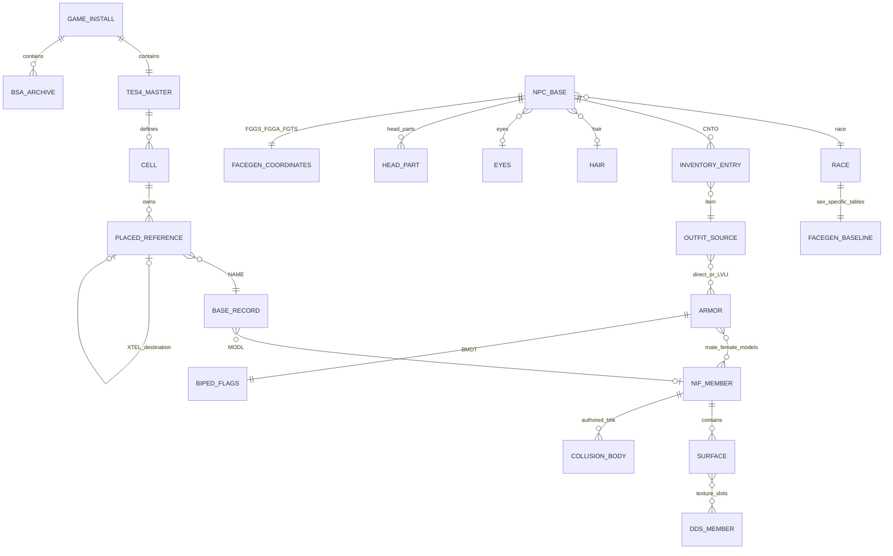

# OpenNV data and configuration accountability

Status: **enforced for all first-party executable C#, Python, JavaScript, and
PowerShell, with unsupported source-language detection**.

OpenNV has one rule for every meaningful value: it is either authored Fallout
data, an immutable external-format or mathematical contract, or an explicitly
named OpenNV policy in
`runtime/config/open-nv-runtime-v1.json`. A value cannot silently fall through
to a guessed runtime default.

## The four allowed value classes

| Class | Location | Examples | Rule |
| --- | --- | --- | --- |
| Fallout-authored data | ESM/BSA/NIF/DDS/KF and generated manifests | ACHR position/rotation/XSCL, WEAP damage/clip/ammo, XTEL destination, CNTO/LVLI outfit graph, BMDT hair slot, NIF material flags, XCLL lighting | Parse and preserve it; never replace it with recipe or runtime guesses. |
| OpenNV policy | `runtime/config/open-nv-runtime-v1.json` | player dimensions, XR comfort settings, renderer adapter, diagnostic thresholds, compiler sampling/output policy | Give it provenance and a status, validate it, inject it at a composition root, and hash it into compiled content. |
| External format contract | named module constants | BSA v104 layout, DDS header offsets, glTF component enums, NIF alpha bit fields, FaceGen header sizes | Name it after the external standard. It is not user-tunable configuration; changing it changes how bytes are decoded. |
| Mathematical identity | deliberately tiny literal allow-list | zero/one, vector dimensions, matrix indexing, sign changes | Only `-4..4` are accepted inline. Anything larger or fractional must be named or configured. |

Tests may contain synthetic fixture bytes and expected values. Recipes and the
runtime JSON are data/configuration, not executable code. Generated caches,
images, binaries, and third-party sources are outside the source-literal scan.
Godot resources, package/workflow manifests, HTML, and CSS are declarative
configuration surfaces rather than executable behavior. The gate inventories
those files, forbids project-level viewport/clear-color copies of injected
runtime policy, and fails if a new executable file type appears in a production
source directory without a scanner.

## Owned-data entity graph

This graph is why actor assembly is not a list of hand-picked meshes. An ACHR
resolves to its NPC_, race, FaceGen coordinates, inventory, recursive LVLI
entries, ARMO models, and BMDT hair visibility. A CELL reference resolves to a
base record and its model; runtime node creation consumes that manifest rather
than inventing placements.

## Opening command and save accountability

The opening compiler traverses the owned quest stages and dialogue graph once,
then seals every emitted command in
`opennv-owned-opening-command-contract/v1`. The seal contains the total command
count, per-kind counts, and per-identity-field counts. Item, quest, global,
owner, and reference editor identities must resolve to exactly one owned record;
the compiler writes the stable FormID and record type beside the authored
command. Unknown command kinds and ambiguous or missing records are compile
errors. The Godot loader independently reconstructs the counts and validates
the same identities before any command runs.

Runtime code owns only operation semantics. Quest stages, timers, item counts,
actor values, objective indices and text, global values, reference state,
packages, animations, dialogue choices, voice/LIP members, and world targets all
come from the verified flow. Movement uses the shared configured input map and,
only while the opening is active, the CELL's owned NAVM plus configured capsule
dimensions. It does not carry a Doc-specific coordinate, route, key, item, or
stage table.

`opennv-campaign-save/v6` embeds
`opennv-opening-campaign-state/v1` in the same atomic save envelope used by the
gameplay session. Loading validates schemas, normalized FormIDs, uniqueness,
finite values, transform shape, and the flow-specific character constraints
before restoring state. Version 4 additionally records the active CELL FormID;
Continue rejects an active CELL outside the prepared ordered route before it
restores the player transform. Version 5 adds source-identity-checked remaining
counts for each opened container. Version 6 persists the shared gameplay-vitals
state derived from the owned player, AVIF, and GMST contracts while retaining
v1-v5 load compatibility. A
headless two-process gate reaches the authored
autosave, exits, reloads that exact incomplete state, and requires the owned
completion stage and command effects. Godot's configured input events and
authored UI signals drive the gate; Windows app control and foreground input
injection are prohibited.

## Single injection path

The C# runtime loads exactly one typed `RuntimeConfiguration` in
`RuntimeCoordinator`. The coordinator passes that instance to every loader,
player, session, capture, preview, and setup owner. JSON deserialization rejects
unknown top-level properties. Prepared cell and actor manifests carry the
configuration schema and SHA-256; loaders reject a cache made with any other
configuration.

The Python content composition roots load the same bytes and pass typed
`ContentCompilerConfiguration` values into actor, static-NIF, texture, and LAND
export. There is one NIF roughness translation for actors, static glTF, and
runtime material bindings. Build scripts do not repeat retail weapon stats or
coverage totals: `validate_runtime_report.py` joins reports back to the actual
owned-data manifests and this configuration.

### Prepared-cache compiler families

New Vegas derived caches use four separately hashed compiler families:
`static`, `cell`, `opening`, and `actor`. Opening/UI source changes affect the
opening family and, because that graph owns actor animation membership, the
actor family. They do not affect static NIF or CELL world identity. Every
admitted manifest carries its family/name/hash tuple; the install manifest seals
the complete family set and owned-input hashes. Explicit preparation reuses a
family only when those identities, route recipes, dependency rows, and output
hashes all match. `TryRestore` never recompiles. Legacy single-identity caches
fail closed and require one explicit migration build.

## Configuration ownership

| Section | Owner and present truth |
| --- | --- |
| `world` | Verified Gamebryo world-unit conversion. |
| `simulation`, `player.desktopInput`, `xr`, `pool`, `hud` | Explicit OpenNV flat/VR policy; physical key/mouse bindings, simulator thresholds, pool input/mount/contact-proof tuning, and hardware/playtest gates are stated separately from retail data. |
| `renderer` | Honest parity-failing Godot adapter; raw authored XCLL/material inputs remain available. |
| `door` | Explicit non-parity fallback angle for verified single-piece, non-controller doors. Controller-bearing doors instead consume hash-joined owned NIF Open/Close transforms and exact moving visual/collision membership; the fallback may not impersonate a decoded controller track. |
| `capture`, `proof`, `retailActorState`, `actorParity` | Diagnostic-only gates, never world or actor authoring data. |
| `performance` | Diagnostic-only passive sampling interval for Godot's built-in runtime monitors; it defines no pass/fail threshold. |
| `diagnosticPreview`, `setupView` | Diagnostic/setup presentation only. |
| `desktopLauncher` | Independently packaged launcher boot-window and notification presentation, copied from this same file at package time. |
| `exteriorEnvironment` | Honest parity-failing clear-day adapter until climate/weather/time evaluation exists. |
| `legalAssets` | Asset-free local-import/cache policy plus the configured owned master/archive names, ordinary opening CELL recipe, and separate linked-world proof recipe. The acceptance gate may not silently reuse a different product route's spawn assumptions. |
| `tooling` | The single recipe-file registry used by first-party compilers, corpora, capture plans, and gallery preparation. |
| `contentCompiler` | Deterministic output, authored-animation sampling, material translation, LAND layering, retail-grass reconstruction, and explicit SpeedTree billboard policy. Remaining renderer gaps stay parity-failing. |
| `actorCompiler` | Record-type animation, rigid-attachment, FaceGen material, and FaceGen LIP/TRI format/binding profiles. Actor identity, meshes, textures, morph bytes, voice/LIP pairs, placement, and KF bytes come from the owned graph; unresolved head-controller and expression/mood behavior remains explicitly unbound. |

## Gallery composition, cache sealing, and complexity

The wasteland gallery is a generic composition root, not thirteen executable
special cases. Its versioned recipe declares scene profiles, subject profiles,
locations, FormIDs, enable state, output names, and any explicitly accepted
unsupported source geometry. The compiler owns only strategy registries for
supported scene/record families. Adding a person, creature, or location changes
JSON, not Python or C#.

Every reusable location scene carries an
`opennv-gallery-location-contract/v1` seal over the merged scene recipe, runtime
configuration, gallery compiler source set, scene compiler, owned master, CELL,
worldspace, and coordinate origin. Reuse fails closed if any member differs. An
older visually attractive scene can therefore never be silently paired with a
new actor or renderer configuration.

The batch path is linear in declared gallery rows:

- locations and subjects are traversed once;
- location and subject joins use hash indexes;
- the actor catalog, runtime configuration, and actor archive stacks are created
  once and shared by all subject strategies;
- BSA member and prepared-texture resolution uses prebuilt indexes;
- no subject performs a scan over previously compiled subjects or locations.

The compiled manifest records these algorithm contracts and all source/config
hashes. The fixed external record-decoder work for a location remains isolated
inside the shared cell compiler and is never multiplied by a content-specific
search loop.

## Enforcement and promotion

`scripts/audit_source_constants.py` parses Python AST (including the packaging
spec, hook, and the audit itself) and scans non-string code tokens in C#,
JavaScript, and PowerShell. Production literals outside the tiny mathematical
allow-list fail unless they are named compile-time contracts. Its own language
scanners and the Godot bootstrap-duplication check have unit tests. The same gate
rejects content FormIDs, owned asset paths, owned file names, hashes, recipe or
gallery identities, and guessed-substitution language in executable source; it
also rejects guessed-substitution language in JSON configuration. The pass
line reports audited source-file, source-line, and declarative-configuration
counts. `Test-GodotRuntime.ps1` runs this gate, so release CI and packaging
inherit it.

The policy is necessary but not sufficient. Promotion also requires:

1. all unit tests and C# build/format checks;
2. a fresh, non-overwritten cache from a hash-pinned legal install;
3. manifest/configuration hash agreement;
4. exact runtime counts derived from those manifests, not copied numbers;
5. reciprocal XTEL, authored floor collision, closed/open projectile checks,
   and two-way capsule traversal;
6. retail/Godot matched-state telemetry and visual review for fidelity claims.

Current deliberate failures remain visible in configuration provenance. A
green constant gate does not mean retail renderer, actor package/idle state,
door controllers, weather, VATS, or full campaign behavior are complete.
