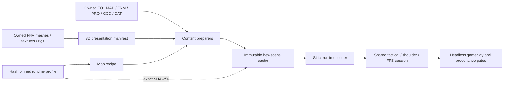

# Fallout 1 data-driven runtime contract

Status: **the V13ENT 3D vertical-slice path is hash-pinned, fail-closed, and
runtime-profile driven; whole-campaign promotion is not complete**.

This contract separates game authority from presentation adaptation. It is a
guard against turning one successful Vault 13 scene into a collection of
untraceable literals or claiming that a Fallout: New Vegas donor asset is
Fallout 1 source truth.

## Authority boundary

| Concern | Authority | Transport |
| --- | --- | --- |
| Map identity, elevation, tiles, blockers, objects, critter placement | owned Fallout 1 / Fallout Et Tu MAP records | `prepare_fo1_hex_scene.py` |
| Art identity and source reference frames | owned Fallout FRM/FID records | hash-verified PNG derivatives in the ignored cache |
| Critter statistics and state | owned Fallout PRO and MAP object records | scene entities; no runtime fallback statistics |
| First-run tile and facing | owned V13CAVE script evidence plus MAP fallback | map recipe and generated scene manifest |
| Character picker, premades, Pip-Boy 2000, opening | owned Fallout DAT/GCD/FRM/MVE/text records | hash-verified character-start manifest |
| 3D actor, rat, cave, and Vault presentation | hash-pinned assets from the locally owned Fallout: New Vegas installation | presentation recipe and private ignored cache |
| Camera, fog, lighting, cutaway, readability, FPS feel, and proof timing | OpenNV adaptation | `fo1-classic-3d-runtime-v1.json` |

Fallout 1 did not ship these environments as 3D meshes. The New Vegas meshes,
textures, skeletons, and animations are therefore presentation donors only.
They never decide Fallout 1 topology, placement, identity, statistics, or quest
state. Generated continuous-floor and overlay meshes are code-native geometry
derived from the Fallout walkable-hex set; they are not third-party art.

## Manifest chain

The map recipe references the runtime profile with an exact relative path and
SHA-256. The preparer refuses a path outside `content/recipes`, rejects a hash
mismatch, validates every required section, and embeds the complete profile and
its recipe hash in `hex-scene.json`. The C# loader accepts only schema
`opennv-fo1-runtime-profile-recipe/v1`; missing, non-finite, duplicate, or
out-of-range values fail scene loading. There are no runtime fallback tuning
values.

The runtime profile is the single owner for:

- 2D-to-3D generation scales, obstacle bounds, fixed sprite orientation, and
  deterministic placement adaptation;
- floor, grid, door, Vault-corridor, lighting, depth fog, and local volumetric
  fog presentation;
- tactical, shoulder, and first-person camera behavior and pair framing;
- tactical travel, FPS locomotion/hitscan, deterministic provisional damage,
  and bounded rat-turn adaptation;
- rat readability, markers, labels, highlighting, grounding, and animation;
- camera cutaway role policies; and
- non-authoritative showcase timing.

Map-local identities and data remain in the map recipe or source-derived scene,
including the default floor ID, critter PID-to-display-name mapping, and the
isolated-proof player/weapon record. That proof player is explicitly
provisional and is replaced by the selected owned GCD/custom character on the
new-game path.

## Literal policy

Runtime consumers may contain only these kinds of numeric literals:

1. mathematical identities and dimensional operations (`0`, `1`, halves,
   radians, array indices, epsilon checks);
2. format invariants fixed by the source format (the 200x200 hex namespace,
   100x100 floor namespace, six neighbor directions, schema versions);
3. validation safety bounds which reject corrupt/unreasonable input; and
4. proof assertions derived from an exact source or manifest contract.

Content IDs, tiles, placement values, material/camera/fog tuning, combat
adaptations, and showcase timings are forbidden in the core consumers. The
regression test `test_fo1_runtime_profile.py` verifies the exact profile hash,
schema ownership, provenance labels, finite values, fail-closed path handling,
and known adaptation-leak signatures. New adaptation data belongs in the
versioned profile, followed by a new hash and a fresh immutable cache revision.

## Complexity and scaling

Let `H` be map hexes, `O` source objects, `A` presentation instances, `M` mobs,
and `E` walk-graph edges.

| Operation | Bound | Note |
| --- | --- | --- |
| Scene preparation | `O(H + O + A)` | source tables and placement rows are streamed/iterated; deterministic maps use keyed lookups |
| Scene load | `O(H + O + A + M)` | one pass per manifest collection plus bounded-neighborhood footprint marking |
| Hex overlay construction | `O(H)` expected | unique edges use a hash set rather than pairwise hex comparison |
| One path query | `O(H + E)` | breadth-first traversal of the current map graph |
| Visibility/readability update | `O(M)` | no pairwise mob comparison |
| Campaign inventory | `O(N + total MAP bytes)` | each locally present map is parsed once |

This is linear in scene data for preparation/loading and linear in the map graph
for one path request. Rat turns may request more than one path, so a turn is
bounded by the number of locally active rats times one graph traversal; local
activation prevents whole-cave work but is not presented as a universal
`O(H + M)` AI scheduler. If “O(N) compliant” means every campaign map can be
added as data without map-specific runtime classes, the architecture is aimed
there but has not earned that promotion yet.

## Promotion state

| Gate | State |
| --- | --- |
| V13ENT source parsing and immutable cache generation | pass |
| Runtime-profile hash/path/schema validation | pass |
| Runtime consumers use the embedded profile for core 3D adaptation | pass |
| Headless centered-hex movement, tactical combat, FPS look/locomotion, and save proof | pass |
| All visual assets come from locally owned Fallout data or code-native source-derived geometry | pass for the private V13ENT slice |
| Original character-start rules fully externalized from runtime code | partial: selectable lists/limits are manifested, derived-stat algorithms still live in `Fo1CharacterProfile.cs` |
| Proof/showcase UI composition contains no authored layout literals | partial: timing is profiled; proof-only shot/UI composition remains code-owned |
| Generic map presentation without V13ENT labels or node assumptions | not yet promoted |
| Whole Fallout 1 campaign | 1 of 96 maps promoted |
| Dialogue, quests, full combat, inventory, and saves | not promoted |
| Physical OpenXR acceptance | not promoted |

Accordingly, the current Vault 13 slice is safe to iterate on without scattering
new camera/fog/combat constants. It is not accurate to call the complete game
data-driven or production-ready until the remaining partial/not-promoted rows
have their own source contracts and corpus gates.
