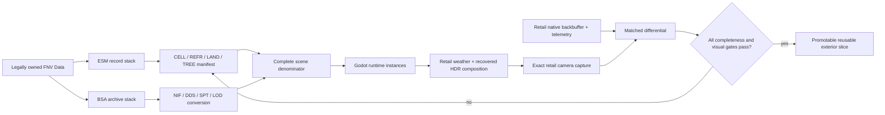

# Goodsprings retail-parity recovery handoff

Date: 2026-08-25
OpenNV worktree: `D:\Builds\OpenNV-actor-godot-20260824-r1`
Branch: `codex/whole-game-actor-godot`
Starting commit: `60ae3d06b4d7f82e1b03b8da7ce456d262195dec`
Capture worktree: `D:\Builds\nikami-worlds-actor-capture-20260824-r1`
Owned FNV install: `D:\SteamLibrary\steamapps\common\Fallout New Vegas`
Godot: `D:\code\gd\Godot_v4.6.3-stable_mono_win64.exe`

## Mission

Produce a new, matched Sunny Smiles / Goodsprings front-portrait comparison in
which the OpenNV Godot frame is structurally complete and visually close to the
retail frame. Do not present another capture as progress while the near terrain,
visible full-detail references, SpeedTree vegetation, distant object/terrain LOD,
or recovered HDR composition tier is absent.

This is the first proof for the general whole-game data path. The implementation
must remain owned-data driven and reusable for every exterior cell; no Goodsprings
model lists, hand-placed houses, hue compensation, or per-screenshot transforms.

## Current verdict

The current image is an honest parity failure, not a tuning problem:

- differential MAE: `0.138`;
- changed pixels: `98.5%`;
- exact retail camera/projection is already applied;
- actor and nearby mailbox placement are close enough to prove the cell origin is
  broadly correct;
- the white foreground house, road/concrete layers, shrub density, and distant
  water tower/settlement mass are absent;
- the OpenNV frame is strongly orange/yellow because the terrain material and
  final HDR path are incomplete.

Current comparison:

`D:\Builds\OpenNV-actor-sunny-differential-20260825-r10-map-marker-hidden\000-front-portrait-frame-000070-retail-vs-godot.png`

Current Godot capture:

`D:\Builds\OpenNV-actor-godot-sunny-capture-20260825-r22-map-marker-hidden`

Current owned background:

`D:\Builds\OpenNV-goodsprings-actor-review-background-20260825-r17-map-marker-hidden\generated\cells\goodsprings-actor-review-background-v1\cell-scene.json`

Current retail contract and observation:

- `D:\Builds\OpenNV-actor-review-sunny-contract-20260825-r5-hdr-inputs-v6`
- `D:\Builds\OpenNV-actor-retail-sunny-observation-20260825-r22-hdr-inputs`

Do not overwrite any of those evidence directories.

## Proven root causes

### 1. Near LAND presentation is lossy

`content/tools/landscape_gltf.py` currently has an old diagnostic path that:

1. resizes every source landscape texture to a 128-pixel tile;
2. repeats it four times per quadrant;
3. composites all BTXT/ATXT/VTXT layers into one 1024x1024 cell texture;
4. binds no landscape normal map.

The center LAND record contains the missing road/asphalt textures, including
`asphaltwasteland01` and `asphaltwasteland02`. The data is present. The renderer
discarded its runtime layer structure and normals.

All generated PNG textures also lacked mip chains before the current
`RuntimeMaterialLoader` WIP, which explains much of the noisy, unstable distance
sampling.

### 2. Near full-detail references are selected but at least one visible house is absent

The manifest contains `NVGoodSprhome01` and its source mesh is nonempty:

- `0017b621` at `[-70387.0703, 9859.2002, 8706.9053]` — this should project near
  the visible white house in the retail frame;
- `0017b641` at `[-68412.2578, 7355.5049, 8506.5400]`;
- `0017b650` at `[-71528, -1056, 8144]`.

The exported `nv_goodspr_home01.nif` has three included surfaces; its main surface
has 5,218 vertices and 3,265 triangles. Triangle winding agrees with vertex
normals. Its authored root is only about five game units below the sampled ground,
so it is not explained by a gross height error.

The next implementation needs per-reference runtime evidence: instantiated node,
final global AABB, camera-space depth, projected screen bounds, visibility flag,
and surface/triangle counts. Do not guess at transforms until this report shows
where `0017b621` went.

### 3. SpeedTree vegetation is explicitly excluded

The scene coverage lists hundreds of `WastelandShrub01` references as
`unsupported-model-format` because their model is `wastelandshrub01.spt`.
Therefore the sparse shrubbery is expected and cannot be fixed by lighting or
terrain texture work. Near-cell `.spt` presentation needs an owned-data converter
and a runtime contract, with a fail-closed denominator for every selected TREE
reference.

### 4. The entire distant LOD tier is missing

The current scene loads only the retail 5x5 full-cell grid (`x=-20..-16`,
`y=-2..2`). It has no object or terrain LOD implementation.

The owned BSAs already contain the required prebuilt assets:

- `Fallout - Meshes.bsa`: 1,655 entries below
  `meshes\landscape\lod\wastelandnv\...`;
- `Fallout - Textures2.bsa`: 2,722 corresponding LOD textures and normals;
- object LOD lives below
  `meshes\landscape\lod\wastelandnv\blocks\...`;
- Goodsprings-adjacent examples include
  `wastelandnv.level4.x-20.y0.nif` and
  `wastelandnv.level4.x-16.y0.nif`.

The nearby `NVWaterTank` reference `00106b5e` projects off the right edge of this
portrait. The hilltop tower visible in retail is consequently expected to come
from distant object LOD. Loading more arbitrary full cells is not the retail data
path and is not the fix.

### 5. The final HDR/image-space chain is incomplete

OpenNV currently applies portions of weather, cinematic, tint, and fade state, but
does not reproduce the recovered HDR adaptation, bright-pass, bloom, and final
join in the live Godot renderer. The offline recovered shader replay is already
96.89% byte-exact and every channel value is within one code value. Port that
contract; do not use a compensating orange/blue hue slider.

## Authoritative data flow



## Worktree checkpoint and immediate hazard

The worktree is intentionally dirty with the complete actor/environment slice;
do not reset or discard unrelated changes.

At handoff, `python -m py_compile content/tools/landscape_gltf.py` and
`git diff --check` pass. However, the layered LAND conversion is an
**integration-incomplete WIP**:

- `content/tools/landscape_gltf.py` now begins returning a `LandscapeExport`
  object with four quadrant surfaces, original diffuse/normal textures, packed
  VTXT masks, tangents, and a diagnostic bake;
- `content/tools/exterior_scene.py` and
  `content/tools/cell_landscape_compile.py` still tuple-unpack the old return;
- `runtime/src/RuntimeMaterialLoader.cs` generates mip chains but does not yet
  implement the `landscapeContract` shader binding;
- no fresh content preparation or engine capture has been run after this WIP.

The next task must either finish this change atomically or back out only this
layered-LAND scaffold using `apply_patch`. Do not launch a capture from the current
integration-incomplete state.

## Execution plan

### Phase 0 — protect and baseline the worktree

1. Read this file, `docs/architecture.md`, and the complete
   `opennv-godot-owned-data` and `nikami-parity-review` skills.
2. Run `git status --short`, `git diff --check`, Python syntax/tests, and the C#
   build before editing.
3. Preserve all existing dirty files. Never use `git reset --hard` or checkout
   paths from the dirty branch.
4. Keep output caches disposable and uniquely named. Never overwrite evidence.

Baseline commands:

```powershell
Set-Location 'D:\Builds\OpenNV-actor-godot-20260824-r1'
git status --short
git diff --check
python -m py_compile content\tools\landscape_gltf.py content\tools\exterior_scene.py
python -m unittest discover -s content\tests -p 'test_*.py'
dotnet build runtime\OpenNV.csproj --no-restore
```

### Phase 1 — add a runtime completeness ledger before more visual guessing

1. Extend `CellContentLoader.LoadedContent` with a `PlacedReference` list containing
   form ID, base ID/editor ID, asset ID, placement node, visual instance, source
   cell, surface count, vertex count, and triangle count.
2. After `ActorReviewBackground.AlignToActor`, compute each mesh's transformed
   eight-corner AABB, camera-space depth, frustum intersection, and projected
   pixel bounds.
3. Write those rows into every actor-review capture report.
4. Derive the visible-reference denominator from the compiled scene plus exact
   camera—not a hardcoded Goodsprings list.
5. Fail the capture if a reference expected in the view has no instantiated
   geometry, an invalid AABB, zero triangles, or an unexplained cull.
6. Use the report to fix `0017b621` generically. Verify root transform, glTF import
   visibility, material alpha/cull state, scale composition, and camera clipping in
   that order.

Exit gate: the white house and every other in-frustum supported NIF reference are
accounted for by form ID and visibly rendered.

### Phase 2 — finish the shared layered LAND path

1. Finish the four-surface quadrant exporter in
   `content/tools/landscape_gltf.py`.
2. Preserve one BTXT base plus ordered ATXT/VTXT blends per quadrant. Pack four
   17x17 opacity grids per RGBA mask. The current corpus maximum is six alpha
   layers per quadrant, which fits the declared 16-sampler renderer budget:
   two base samplers, twelve layer samplers, and two masks.
3. Prepare the exact TXST diffuse and normal DDS sources through the owned archive
   pipeline. Missing authored normals must bind the named neutral-normal service,
   not a hidden constant.
4. Generate glTF tangents and retain vertex-color multiplication.
5. Implement one `ShaderMaterial` builder in `RuntimeMaterialLoader` for the
   generated `opennv-landscape-layer-material/v1` contract. Use anisotropic mip
   filtering and source-texture repeat; sample masks clamped and without mip LOD.
6. Make `exterior_scene.py`, `cell_landscape_compile.py`, the shared static-cell
   manifest, and validators consume the same `LandscapeExport`. There must not be
   a review-only terrain implementation.
7. Retain the old 1024 bake only as explicitly named diagnostic output. It must not
   be bound by parity presentation.
8. Add synthetic tests for quadrant geometry, mask channel/order, null ATXT
   fallback, diffuse/normal provenance, sampler budget, texture de-duplication,
   tangent coverage, and shared compiler validation.

Exit gate: asphalt/concrete and dirt boundaries align with retail; all LAND layers
and authored normals are represented; the runtime manifest contains no duplicate
texture IDs; no shader/compiler errors occur.

### Phase 3 — support every selected near-cell SpeedTree reference

1. Add TREE/SPT provenance to the cell catalog instead of reducing it to an
   unsupported model string.
2. Inventory the exact FNV `.spt` version, embedded texture references, billboard
   data, branch/leaf meshes, wind parameters, bounds, and draw policy from owned
   files and retail observation.
3. Implement a deterministic owned-data converter and a typed asset/material
   contract. Prefer real geometry for the near tier and authored billboards at the
   retail transition; do not replace shrubs with a generic crossed quad.
4. Instance them through the normal reference path and add them to the same
   completeness ledger and material provenance checks.
5. Treat every selected TREE/SPT exclusion as a hard capture failure until the
   converter accounts for it.

Exit gate: the current Goodsprings scene has zero `unsupported-model-format`
exclusions for selected `.spt` references, and shrub/tree density matches the
retail frame at the exact camera.

### Phase 4 — implement owned terrain and object LOD streaming

1. Catalog the worldspace LOD hierarchy from the owned Meshes and Textures BSAs.
2. Decode block level, X/Y ownership, local origin, bounds, textures, normals, and
   material semantics from the filenames and NIF payload—never from a hand-entered
   Goodsprings block list.
3. Select blocks by camera/frustum and retail distance policy. Use full-detail 5x5
   cells as holes in the LOD coverage so near and distant representations do not
   z-fight or duplicate.
4. Load both terrain LOD and object LOD. Keep their provenance and coverage in the
   cell-scene manifest.
5. Add seams/overlap/hole validators and a report listing every selected block,
   projected bounds, level, source hash, and reason selected.

Exit gate: the hilltop water tower, distant houses, mountain/street mass, and
horizon coverage appear at the retail positions with no holes, duplicate blocks,
or visible seams.

### Phase 5 — port the recovered live HDR composition

1. Use the retained retail shader/input contract in
   `docs/evidence/fnv-retail-material-shader-contract.md`.
2. Implement adaptation, bright-pass, bloom, and final join as a named renderer
   service/compositor stage with all coefficients sourced from the captured
   image-space contract or the single runtime configuration document.
3. Preserve linear/sRGB boundaries and render-target formats from telemetry.
4. Compare intermediate buffers as well as the final eye image.
5. Remove provisional presentation labels only when the recovered stage is live
   and validated.

Exit gate: no arbitrary color-compensation parameter exists; sky, terrain,
buildings, and Sunny all move toward retail together; regional hue/luminance
errors improve rather than merely reducing whole-frame MAE.

### Phase 6 — fresh matched proof and promotion

1. Prepare a new uniquely named owned-data background cache.
2. Run the mandatory capture preflight immediately before launching Godot.
3. Use only the canonical background-capture entry point. Do not use Computer Use,
   clicks, focus changes, OS input, or foreground activation.
4. Capture Godot and retail sequentially, never concurrently, and retain native
   frames plus telemetry.
5. Generate a new side-by-side and differential. Report whole-frame MAE plus
   regional structure/color metrics for terrain, buildings/LOD, vegetation, sky,
   and actor.
6. Promote only a coherent, tested slice with no open integration breaks.

Fresh background preparation template:

```powershell
Set-Location 'D:\Builds\OpenNV-actor-godot-20260824-r1'
python content\tools\prepare_exterior_cell.py `
  --data-root 'D:\SteamLibrary\steamapps\common\Fallout New Vegas\Data' `
  --cache-root 'D:\Builds\OpenNV-goodsprings-background-<unique>' `
  --recipe 'goodsprings-actor-review-background-v1'
```

Mandatory preflight and capture templates:

```powershell
Set-Location 'D:\Builds\nikami-worlds-actor-capture-20260824-r1'
& .\scripts\Test-FNVJamBackgroundCapture.ps1 `
  -Target Godot `
  -Scenario GodotActorReview `
  -OpenNvRoot 'D:\Builds\OpenNV-actor-godot-20260824-r1' `
  -ActorReviewScene '<fresh compiled Sunny review scene>' `
  -ActorReviewBackgroundCell '<fresh compiled Goodsprings cell-scene.json>' `
  -GodotBinary 'D:\code\gd\Godot_v4.6.3-stable_mono_win64.exe' `
  -RuntimeReady `
  -RequireIdle

& .\scripts\Invoke-FNVJamBackgroundCapture.ps1 `
  -Target Godot `
  -Scenario GodotActorReview `
  -OpenNvRoot 'D:\Builds\OpenNV-actor-godot-20260824-r1' `
  -ActorReviewScene '<fresh compiled Sunny review scene>' `
  -ActorReviewBackgroundCell '<fresh compiled Goodsprings cell-scene.json>' `
  -GodotBinary 'D:\code\gd\Godot_v4.6.3-stable_mono_win64.exe' `
  -OutputRoot 'D:\Builds\OpenNV-actor-godot-sunny-capture-<unique>'
```

Read and obey
`D:\Builds\nikami-worlds-actor-capture-20260824-r1\docs\fnv-jam-background-capture.md`
before any engine launch.

## Acceptance matrix

| Area | Required evidence | Hard failure |
|---|---|---|
| Camera | exact captured retail frustum, pose, frame size | hand-tuned camera or crop |
| Full statics | per-reference instance/AABB/screen ledger | visible supported REFR absent |
| Near terrain | all BTXT/ATXT/VTXT layers, normals, tangents, mips | diagnostic bake bound in parity mode |
| Vegetation | every selected SPT/TREE reference accounted for | unsupported `.spt` exclusions |
| Distant world | terrain and object LOD block coverage report | horizon/building/water-tower holes |
| Materials | owned DDS provenance and typed shader contract | fallback color/material hides failure |
| Color/HDR | recovered stage plus intermediate-buffer comparison | arbitrary hue/exposure compensation |
| Actor | exact source parts, face, hair, pose, placement | generic face/body/pose substitute |
| Capture | canonical no-control fresh evidence directory | overwrite, UI automation, concurrent engines |

## Engineering constraints

- One data path for gameplay, review, flat mode, and VR.
- No OpenMW runtime dependency and no copied OpenMW implementation.
- No model/reference lists hardcoded for Goodsprings.
- No unexplained numbers in code. Engine invariants get named constants; tunable
  policy belongs in the single runtime configuration; Fallout values come from
  owned data and are written to manifests.
- No stubs, silent exclusions, or “temporary” generic geometry in parity mode.
- Every conversion artifact carries source identity, source hash, compiler hash,
  counts, bounds, and explicit coverage.
- Every failure must remain visible in the report; do not make screenshots look
  better by hiding unsupported content.
- Use `apply_patch` for source edits and preserve the dirty worktree.

## First concrete outcome expected from the next task

Do not start by tuning the sun. First deliver a fresh diagnostic capture report
that explains `0017b621` by final AABB/screen bounds and a completed, tested shared
layered-LAND implementation. Then show one new matched front-portrait side-by-side
where the white house and road/concrete layers are restored. SpeedTree and LOD are
the next mandatory structural slices; the capture remains a declared failure until
they are present.
