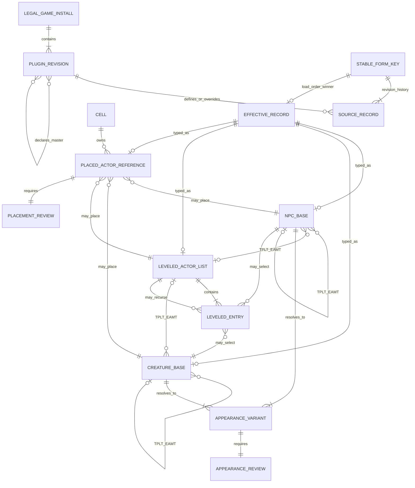
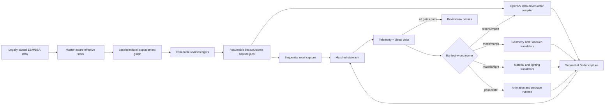

# Whole-game actor and creature parity

Status: **inventory complete; visual review pending**.

OpenNV treats every effective official `NPC_` and `CREA` record, every
leveled/template outcome, and every effective `ACHR` and `ACRE` placement as
an accountable review unit. Goodsprings is the first debugging slice, not the
scope boundary. User mods are intentionally a separate corpus so they cannot
change the vanilla baseline.

The private corpus is generated from the player's legally owned files with:

```powershell
py content/tools/actor_parity_corpus.py `
  --data-root '<Fallout New Vegas>\Data' `
  --output-root '<fresh private output folder>'

py content/tools/validate_actor_parity_corpus.py `
  --corpus-root '<that private output folder>'

py content/tools/actor_capture_plan.py `
  --corpus-root '<that private output folder>' `
  --output-root '<fresh private capture-plan folder>'

py content/tools/validate_actor_capture_plan.py `
  --plan-root '<that private capture-plan folder>' `
  --corpus-root '<that private output folder>'
```

The output folder must be new. ESM-derived rows, retail frames, and Godot
frames remain private and are never committed or placed in an asset-free
release.

## Entity and ownership model



The stable key is `owner plugin + 24-bit object ID`; the high byte in an ESM
is plugin-local and is never used as global identity. `plugin_stack.py` maps
each local master slot through the declared `MAST` order, then the configured
official load order. Later overrides replace earlier revisions and deleted
records become tombstones. This prevents DLC records from being double-counted
or attached to the wrong base, cell, race, item, or template.

`EAMT`, not trailing `ACBS` bytes, owns the ten independent template-category
flags: traits, stats, factions, actor effects, AI data, AI packages, model,
base data, inventory, and script. For FNV humanoid traits, retail observation
also requires the `ACBS` `UseTemplate` actor flag; a `TPLT`/`EAMT` pair alone
does not replace authored race, hair, eyes, head parts, or FaceGen. The corpus
enumerates template/list selections, resolves the source of every category,
then collapses selections with identical category-source maps into one exact
review variant.

The modules have one job each:

| Module | Responsibility |
| --- | --- |
| `plugin_records.py` | Bounded TES4 container and subrecord decoding; declared-master inventory. |
| `plugin_stack.py` | Stable FormID identity, master-slot mapping, source hashes, and runtime FormIDs. |
| `actor_catalog.py` | Typed `NPC_`, `CREA`, `ACHR`, `ACRE`, `LVLN`, `LVLC`, appearance, inventory, and transform records. |
| `actor_parity_graph.py` | Recursive template variants and concrete candidates for leveled placements. |
| `actor_parity_records.py` | Canonical record rows and override/deletion merge for the effective actor stack. |
| `actor_parity_corpus.py` | Official-stack composition and immutable review-ledger generation. |
| `validate_actor_parity_corpus.py` | Independent hashes, row counts, uniqueness, graph closure, and exact coverage checks. |
| `actor_capture_plan.py` | Review rows to bounded, resumable base jobs and telemetry-correlated expected outcomes. |
| `validate_actor_capture_plan.py` | Independent job/batch hashes, exact review coverage, strategy, and source-stack checks. |

No actor recipe, hand-placed mesh, guessed outfit, or actor-name switch is
part of this path.

## What “looked at” means

An actor is not complete because it appeared in one favorable screenshot.
There are two independent review ledgers:

1. An **appearance row** exists for every effective base and every reachable
   template/leveled outcome. Humanoids require matched front portrait, both
   profiles, full body, and idle-motion evidence. Creatures require matched
   front detail, both profiles, full body, and idle-motion evidence.
2. A **placement row** exists for every effective `ACHR` and `ACRE`. It requires
   matched in-cell context and activity-motion evidence so identity, enable
   state, equipment, transform, cell lighting, and package-dependent pose are
   reviewed where the game actually uses the reference.

Each evidence pair must join on all of the following, not just a display name:

| Contract | Required match |
| --- | --- |
| Source | Official plugin stack and SHA-256 set. |
| Identity | Stable base, template outcome, and placed-reference keys. |
| State | Enable state, equipment outcome, animation/package state, time, weather, and cell. |
| Transform | Authored position, rotation, scale, skeleton publication, and camera telemetry. |
| Rendering | Mesh parts, morphs, FaceGen, skin/body detail, hair, eyes, materials, lights, shadows, effects, and background. |
| Capture | Same shot kind, projection, resolution, crop, and source-frame provenance. |

The review status begins `pending`. Only a matched retail/Godot pair with
telemetry and a passing visual verdict may move it to `pass`. Inventory
generation alone can never make a parity claim.

The capture-plan compiler emits one job per effective base. A base with one
appearance signature uses one telemetry-correlated observation. A base with
multiple template/leveled outcomes is repeatedly instantiated until every
expected category-source signature has actually been observed. An attempt
limit may stop a run, but it may never turn incomplete coverage into a pass.
The plan contains no camera distances: live render bounds and head markers own
framing for humanoids and differently proportioned creatures.

## Data flow and correction loop



Retail and Godot capture run sequentially through the canonical background
capture lane. A batch is resumable by review key, never overwrites evidence,
and records source frames, telemetry, build identity, and hashes. A failed row
is grouped by its earliest shared owner—parser, template inheritance, NIF/KF,
FaceGen, materials, lighting, animation, placement, or capture—so one systemic
fix replaces thousands of actor-specific patches.

## Promotion gates

The whole-game actor/creature milestone is green only when:

- all required official plugins are present and hashed;
- load-order override/deletion merge validates;
- every base, template outcome, leveled result, and placement is scheduled;
- every appearance review key occurs in exactly one validated capture job;
- every dynamic base remains pending until all expected runtime signatures are observed;
- relationship gaps and duplicate review keys are zero;
- every review row has retained retail and Godot source evidence;
- identity/state/camera/pose telemetry matches;
- every visible component has an owned-data source ID;
- every row passes visual review for geometry, face, hair, body, clothing,
  creature parts, materials, lighting, effects, and context;
- rerunning the corpus and evidence validators is deterministic; and
- public builds remain asset-free and import only from the user's legal data.

Until every row passes, the honest project status is **whole-game inventory
complete, parity incomplete**.
