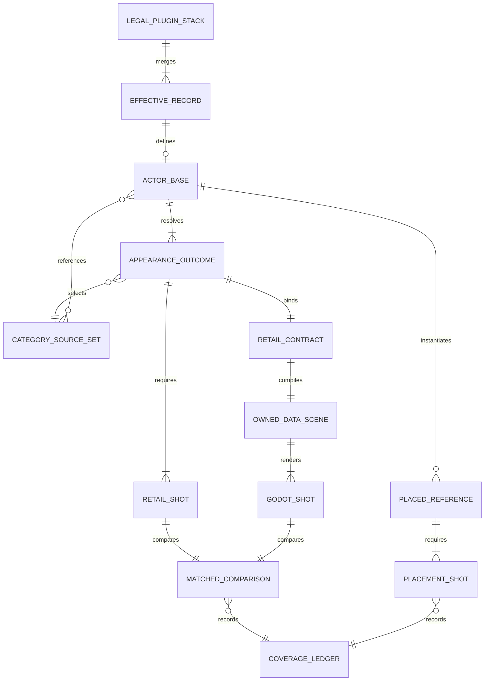
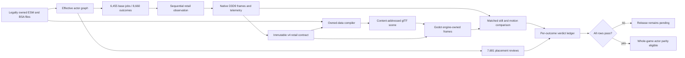
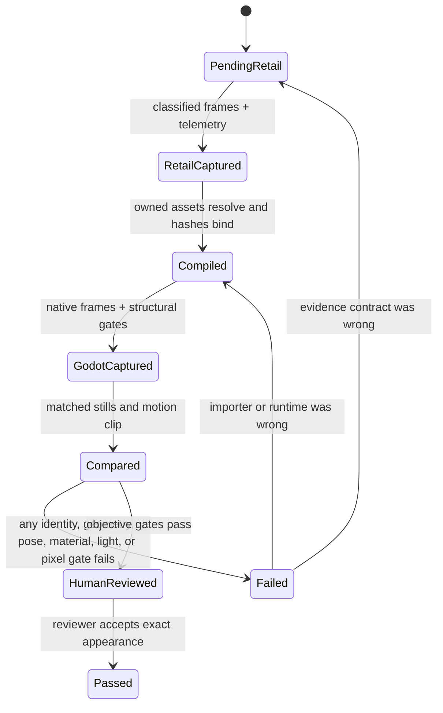

# Whole-game actor and creature parity

Status: inventory complete; matched visual parity pending.

This is an exhaustive gate for the player's legally owned Fallout: New Vegas
data. It is not a showcase roster and it does not infer whole-game quality from
Trudy, Sunny, a dog, or any other representative. A final pass requires evidence
for every resolved appearance and every placed reference in the pinned official
plugin stack.

## Fixed denominator

The current immutable corpus is
`D:\Builds\OpenNV-actor-parity-corpus-20260824-r10` with manifest SHA-256
`bcd780a0749200e35a3dd15670d55a12c85b75136b38495247aa8fff3d17205f`.
Its exact denominator is:

| Entity | Required rows |
| --- | ---: |
| NPC_ bases | 4,220 |
| CREA bases | 2,235 |
| All bases | 6,455 |
| Resolved appearance outcomes | 8,660 |
| ACHR/ACRE placements | 7,681 |
| Appearance stills | 43,300 |
| Placement stills | 15,362 |
| Relationship gaps | 0 |

The capture plan is
`D:\Builds\OpenNV-actor-capture-plan-20260824-r5` with manifest SHA-256
`e27052c2d15c0dae978a467800877b4db468559d7e1bc29b2ddd59b88495360d`.
It contains one base job for every base record. The 658 dynamic bases remain
pending until every declared runtime appearance signature has actually been
observed; partial dynamic coverage cannot pass.

## Domain model

An actor base owns stable identity. An appearance outcome owns the fully resolved
template-category sources for traits, model, and inventory. Multiple outcomes
may belong to one dynamic base. A placement points to a base but has its own
cell, transform, enable state, and contextual acceptance. Assets are not stored
in the repository; an owned-data scene is a disposable cache compiled locally
from the pinned plugins and archives.

## One evidence path

There is no alternate hand-authored actor path. Template selection, sex, race,
FaceGen channels, hair, eyes, head parts, equipment, skeleton, model parts,
materials, textures, animation layers, root transform, skin palettes, camera,
and placement identity must be derived from owned data or retained retail
evidence. Any engine policy not present in Fallout data lives in the single
runtime configuration document and carries provenance.

## Rendering contract

Each retained retail source frame binds all of the following:

- the classified appearance outcome and spawned reference;
- every live runtime attachment's source FormID, source slot, model path, node
  presence, and render-part attribution, including the equipped weapon;
- the native source frame hash and dimensions;
- active animation layers and exact time;
- the actor root and named-node hierarchy;
- every active NiSkinInstance render-cache palette in shader register order;
- the validated NiCamera world transform and its separate culling projection;
- one target-texture-matched skinned draw into the source-resolution Direct3D 9
  scene-color target, including the final projection used to produce pixels;
- environment colors and the currently unresolved lighting fields.

The NiCamera culling projection is not the final-eye projection. Godot uses the
camera world transform plus the captured scene-color projection. Rigid NIF
components use their authored `Prn` skeleton attachment, then a matching NIF
root, then an explicitly configured fallback. Skin weights come from the retail
hardware NiSkinPartition, not editor/CPU fallback weights.

## Acceptance state machine

`captured-pending-parity` is deliberately not a pass. A row cannot pass because
the process launched, a mesh appeared, a palette was internally self-consistent,
or one camera view looked plausible. Missing evidence, unclassified dynamic
outcomes, unresolved assets, and comparison failures remain visible failures.

## Current representative result

The CrDog row proves the current vertical pipeline, not the corpus. Its retail
contract now uses the actual source-resolution scene-color projection (about
59.84 degrees vertical FOV in the retained front frame), fixing the earlier
cropped/sunk Godot result. The exporter now follows the eye-set NIF's authored
`Prn = Bip01 Head` attachment, eliminating detached eye geometry. The capture
passes immutable-hash, final-projection, skin-palette, native-frame, and
no-application-control gates.

CrDog still fails parity because retail light direction, the matched environment,
remaining pose error, material/shader equivalence, and objective pixel comparison
are unresolved. Consequently, the number of fully passed appearance outcomes is
currently zero. That is the honest baseline for the exhaustive sweep.

The newer Sunny Smiles investigation closes a different bounded part of that
same generic path. Retail FaceGen draw capture identifies four independent
sampler roles, the exact encoded-color arithmetic, disabled D3D9 sampler/target
sRGB conversion, and an opaque depth-writing face surface. OpenNV now keeps the
RACE head base and normal, NPC FaceGen detail, and retail tone input separate
until `RetailFaceGenMaterial.cs`. The opaque recapture removes the false grin
caused by teeth and tongue showing through a transparent face. Retail draw
vertices also match OpenNV's face, mouth, upper/lower teeth, and tongue geometry
within floating-point conversion tolerance.

The owned-data actor compiler now also joins every exact sibling `FRTRI003`
member and exports all authored differential and static morphs with their source
names. Paired Fallout LIP files are decoded under the versioned 33-track contract
and sampled from actual voice playback time. The corpus-backed `Eee`-to-`Ee`
binding is declared once in configuration; the three head-controller tracks stay
unbound until their transform publication contract is observed. Generic jaw
motion, audio-amplitude proxies, and per-actor facial tuning are prohibited.

That is not a Sunny pass. The retained r13 Godot report is
`captured-provisional-light-direction`: exact render-cache skin palettes pass,
but the named-node pose diagnostic reaches 8.56 projected pixels in its worst
front-portrait sample, the actor-only review has no retail CELL background, and
retail directional lighting plus HDR/color grading remain unresolved. The next
matched gate places Sunny through her ACHR in the data-built Goodsprings cell
and compares world and actor pixels together.

The generic `content/tools/actor_review_differential.py` gate now hash-verifies
the scene, retail contract, retail frames, Godot report, and Godot frames; pairs
every required `(shot kind, source frame)` exactly; produces side-by-side stills
and a retail-timed H.264 idle-motion clip; and emits one fail-closed coverage
ledger row. It cannot turn a successful capture into a parity pass. CrDog's
current differential contains ten comparisons and correctly fails lighting,
pixel, and pose/structure gates with human review still pending.

`content/tools/actor_review_coverage.py` then performs the exhaustive join back
to the immutable corpus. Its current baseline contains all 8,660 appearance
rows and all 7,681 placement rows: one creature appearance has differential
evidence, 8,659 appearances and every placement are still missing evidence,
zero rows have been human-reviewed, and zero rows pass. Unknown or duplicate
reports are rejected instead of being silently counted.

The former retail queue at
`D:\Builds\OpenNV-actor-retail-coverage-surface-v4-20260824-r3` is quarantined
and contributes zero coverage credit. Its apparent complete Dead Money ghost row
was produced by the v1 appearance contract, which labeled the visible equipped
knife-spear geometry as actor geometry and therefore failed to prove its runtime
source. No row from that directory may be resumed or counted.

The intermediate v2 soak at
`D:\Builds\OpenNV-actor-retail-coverage-surface-v4-20260824-r8` completed 24 of
its first 32 base jobs. Seven model-less turret/hologram weapons were rejected
as missing geometry and the holstered boxing tape on the Starlet remained
incomplete after four deterministic attempts. That immutable run exposed a
contract error and contributes no current-producer coverage credit.

Appearance v3 separates logical equip state from same-frame render state while
keeping both fail-closed. The same nonzero WEAP FormID and `weaponOut` value must
match the pose. `visible-source-bound` requires the exact normalized NIF, node,
and visible source-attributed render part. `not-visible-at-frame` requires
`weaponOut = false` and zero visible weapon parts; a model-less embedded weapon
or an authored holstered model is not turned into invented geometry. Canonical
targeted captures prove both branches:

- `D:\Builds\OpenNV-actor-v3-turret-20260824-r1`,
  `D:\Builds\OpenNV-actor-v3-hologram-20260824-r1`, and
  `D:\Builds\OpenNV-actor-v3-starlet-20260824-r1` are complete nonvisible
  contracts with empty fault ledgers;
- `D:\Builds\OpenNV-actor-v3-dean-20260824-r1` retains eight visible 9mm parts
  and no actor mouth/eye geometry under the weapon role; and
- `D:\Builds\OpenNV-actor-v3-ghost-20260824-r1` retains its visible authored
  knife-spear geometry as an exact source-bound weapon.

These are complete retail observation contracts, not Godot parity passes. The
Ghost owned-data compile still fails closed because the authored model stack
contains `NiParticleSystem` geometry; the generic glTF path rejects that
omission explicitly. A ghost scene without its breathing and leg-spray systems
is not accepted as a complete rendition.

The fresh committed-v3 soak at
`D:\Builds\OpenNV-actor-retail-coverage-surface-v4-20260824-r9` completed all
32 selected base jobs in exactly 32 first attempts. Its checkpoint reports 32
captured outcomes, zero unclassified attempts, zero incomplete appearances, and
zero capture errors. The queue manifest pins the plan, corpus, retail DLL, legal
save and executable, recipe catalog, and all seven producer scripts. The other
8,628 appearance outcomes remain pending, and the retail queue deliberately
reports `parityVerdictStatus = not-evaluated-by-retail-reference-queue`.

The first v3 owned-data Godot integration exposed and then removed a runtime
identity guess: Godot replaces punctuation such as the turret shape's `:` when
it creates node names. Actor glTF v2 now gives every surface a deterministic,
punctuation-safe `runtimeNodeName`, records the exact relation beside the
unchanged NIF shape name, and requires a one-to-one sidecar/import join before
capture. Retail skin palettes select exact authored shape names and are then
disambiguated by bind count and ordered bone identity; no sanitized-name suffix
match remains. The canonical capture at
`D:\Builds\OpenNV-actor-v3-turret-godot-review-20260824-r3` retains ten matched
source frames with its one skin and six palette bones resolved. The differential
at `D:\Builds\OpenNV-actor-v3-turret-differential-20260824-r1` correctly fails:
retail light direction is unresolved, the current neutral Godot review
environment cannot match the retail frame, and named-node pose/surface gates are
not yet within tolerance. It is evidence of a working exact-surface capture
path, not an appearance-parity pass.

## Execution order

1. Lock the representative contract: exact surface projection, component
   attachment, palette application, materials, lighting, and matched comparison.
2. Run the immutable retail queue until all 8,660 appearance outcomes are
   classified; failures and missing dynamic signatures stay in the ledger.
3. Compile each outcome from the player's owned plugins and archives through the
   same NPC_/CREA dispatcher; no per-character recipe is allowed.
4. Capture the same required views and idle interval in Godot, generate the
   side-by-side stills and clip, and write one verdict per outcome.
5. Run placement reviews for all 7,681 ACHR/ACRE references in their data-driven
   cells and transforms.
6. Permit a whole-game claim only when the aggregate ledger has no pending,
   missing, unclassified, failed, or unreviewed row.

OpenMW is not a runtime dependency for this path. Retail supplies legally owned
reference behavior; OpenNV supplies the clean-room importer, C# runtime, Godot
rendering, and acceptance evidence.
