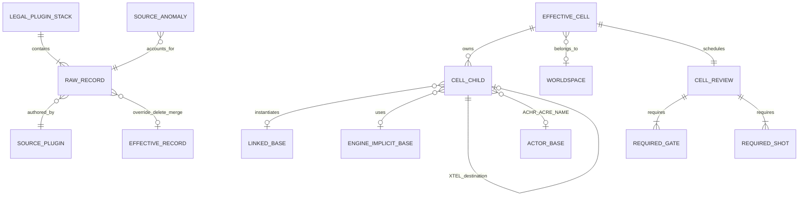
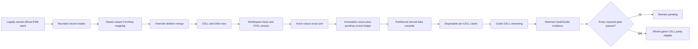

# Whole-game CELL parity

Status: **inventory complete; runtime implementation and matched parity pending**.

This is the fixed denominator for every effective Fallout: New Vegas CELL in
the player's legally owned official plugin stack. It is not a claim that every
CELL renders, streams, simulates, or matches retail yet. The public repository
contains only the compiler, recipe, validator, tests, and documentation; retail
records and generated corpus artifacts remain private and disposable.

## Fixed denominator

The current immutable corpus is
`D:\Builds\OpenNV-cell-parity-corpus-20260824-r6`. Its manifest SHA-256 is
`e779cf083301caca7909a3d52b899e4f8442b1c8e1d22c0625520046e3d84660`.

| Entity | Exact rows |
| --- | ---: |
| Raw CELL records | 44,592 |
| Raw CELL-child records | 476,737 |
| Effective CELLs | 44,517 |
| Interior CELLs | 492 |
| Exterior CELLs | 44,025 |
| Effective CELL children | 475,915 |
| REFR | 419,341 |
| ACHR | 3,942 |
| ACRE | 3,739 |
| LAND | 42,467 |
| NAVM | 6,129 |
| PGRE | 297 |
| Linked base/worldspace records | 17,472 |
| Authored XTEL portal edges | 1,378 |
| Engine-implicit base contracts | 2 |
| Exact source anomalies | 2 |
| CELL review rows | 44,517 |
| Relationship or parse gaps | 0 |
| Exact actor-corpus placement join | 7,681 |

The source-to-effective conservation rule passes by record type. For this
official stack it is:

```text
44,592 raw CELL - 75 overrides = 44,517 effective CELL

476,737 raw children
- 687 non-deletion overrides
- 2 * 67 deletion records (the deletion row and the removed prior row)
- 1 invalid undeclared-namespace source row
= 475,915 effective children
```

The two source anomalies are not hidden:

- `GunRunnersArsenal.esm` REFR `02000801` uses undeclared namespace index `02`.
  Its exact record payload is hash-bound and excluded from the effective graph;
  retail treatment remains pending.
- `FalloutNV.esm` LAND `00150fc0` has a bad zlib checksum. Its deflate payload
  has the declared size and is recoverable; both the payload hash and bad-checksum
  fact remain in the corpus, while runtime semantics remain pending.

References to `FalloutNV.esm:000017` and `FalloutNV.esm:000020` are explicit
recipe-owned plane-marker and portal-marker base contracts. They are not missing
STAT records and are not hard-coded in Python. Their required REFR subrecords
are validated, while their renderer/culling semantics remain pending.

## Domain model



One CELL owns many child records. A placed child belongs to exactly one CELL and
usually points many-to-one to a base record. An XTEL door points to another
placed reference, which owns the destination CELL and authored destination
transform. Actor placement identity stays in this graph; actor appearance
assembly remains in the separate actor corpus. The validator requires the
ACHR/ACRE FormKey, parent CELL, and base link to match that corpus exactly.

## One data path



There is no hand-authored placement path. CELL identity, worldspace ownership,
coordinates, child ownership, transforms, scale, base identity, XTEL endpoints,
enable parent, flags, lighting, and subrecord inventory come from owned data.
The only non-retail identities in this corpus are the explicit versioned recipe
contracts above. Inventory status can never promote a runtime or visual gate.

## Meaning of “every CELL works”

A CELL is not working merely because it was parsed. Its review row starts with
every status `pending` and must independently pass:

- record and resource closure;
- geometry, materials, lighting, weather, and effects;
- authored collision and navigation;
- runtime streaming, persistent-reference, enable-state, and save behavior;
- player and projectile continuity for XTEL doors;
- actor/creature placement and state; and
- matched retail/Godot presentation plus human review.

LAND, NAVM, and XTEL rows add their narrower gates. Unsupported subrecords or
semantics remain visible blockers; the compiler may not substitute a proxy,
default placement, guessed material, or hand-authored room.

## Execution order

1. Partition the corpus into immutable per-worldspace/per-CELL compile jobs and
   disposable content-addressed cache outputs.
2. Produce a child/base/subrecord capability matrix; fail each job closed on an
   unimplemented semantic rather than omitting the row.
3. Generalize owned-data compilation for static references, LAND, NAVM, lights,
   XTEL doors, actors/creatures, and resource closure.
4. Stream one authoritative CELL entity root per active CELL, including
   persistent references, worldspace coordinates, portals, and save state.
5. Add independent package, dialogue, quest, script, scene, weather, and
   enable-parent state graphs needed to reproduce the authored loaded state.
6. Close representative interior, exterior, landscape, navigation, portal, and
   actor differentials before starting the exhaustive 44,517-row review queue.
7. Promote flat and first-class VR gameplay only through the same authoritative
   state, interaction, physics, projectile, save, and evidence paths.

The partitioned compiler ledger and its presentation policies now exist. Model-
bearing `ACTI`, `CONT`, `DOOR`, `MSTT`, `SCOL`, and `STAT` bases share the same
strict static-model transport; `LIGH` and direct-child `LAND` retain their typed
paths. This only admits their initial presentation. Door interaction, container
state, activator behavior, movable-body simulation, effects, and every unknown
reference subrecord remain separate runtime or parity work. The active order is
to close one explicit capability family at a time without deleting the bounded
Goodsprings vertical-slice acceptance test.

## Partitioned compile plan

That first planning slice is now complete at
`D:\Builds\OpenNV-cell-compile-plan-20260824-r2`, with manifest SHA-256
`3971b8ff9726937c21f85d6bf084365b390fb085e3e5b82cde4c21bac6f24091`.
The independent validator proves:

| Compile-plan entity | Exact rows |
| --- | ---: |
| CELL jobs | 44,517 |
| Child relationships | 475,915 |
| Natural partitions | 38 |
| Capability definitions | 173 |
| Deduplicated capability sets | 2,248 |
| Source anomalies assigned to parent CELLs | 2 |
| Pending jobs | 44,517 |
| Ready jobs | 0 |

The plan is 47,671,803 bytes total and is split by authored exterior worldspace
or interior source-plugin ownership. Its largest shard is the main WastelandNV
worldspace at 16,340,678 bytes; there is no whole-game runtime blob. Each job
contains the exact child FormKeys, source CELL hash, capability-set identity,
review gates/shots, and source-anomaly assignments. Every compile output starts
`not-built`; parsing and scheduling did not promote any implementation status.

## Strict content-addressed CELL capabilities

The original `FalloutNV.esm:10561a` (`RanchHouseInterior03`) `r6`/`r7`
artifacts remain useful deterministic geometry-transport evidence, but they are
not a clean general-CELL readiness proof. Their former profile accepted every
`STAT` reference without accounting for all REFR semantics. Recompiling with
the exact base-specific subrecord policy at
`D:\Builds\OpenNV-static-cell-FalloutNV-10561a-20260824-r8-strict` correctly
reports 12 child blockers: five `XEMI` occurrences plus one each of `BNAM`,
`CNAM`, `FULL`, `MMRK`, `MNAM`, `NNAM`, and `XRDS`. It still accounts for all
26 source children and compiles the 10 NIF assets and 12 textures that are
independently supported; the artifact cannot enter the runtime until those
semantics close. This supersedes the old zero-blocker interpretation rather
than hiding the regression.

The first strict zero-blocker capability proof is baseline placed `LIGH` data
in `DeadMoney.esm:0102c7` (`TestSeanMap`). The immutable artifact is
`D:\Builds\OpenNV-light-cell-DeadMoney-0102c7-20260824-r7`; its manifest SHA-256
is `73c3d63f6aff330ce07a1d86742585b66ab129b4db888c35bedee136809021ea`.
This is the current profile-v2 regression after adding direct-child LAND.

| Point-light compile/runtime entity | Exact result |
| --- | ---: |
| Source child outcomes | 3 / 3 |
| Compiled placements | 3 |
| Placed point lights | 3 |
| Content-addressed NIF assets | 0 |
| Compiled DDS textures | 0 |
| Compiler blockers | 0 |
| Accounted artifact files | 5 |
| Accounted artifact bytes | 13,091 |
| Godot authored point lights | 3 |

Each runtime light is sourced through `REFR -> LIGH`: placement and optional
`XRDS` radius come from the reference, while base radius, RGB, flags, falloff,
field of view, and intensity come from the linked `LIGH`. The example proves
that the positive `XRDS` value `83.76019287109375` overrides its 200-unit base
radius, while the other two references retain their 256-unit base radii. The
same profile rejects unknown reference subrecords and invalid or unsupported
numeric contracts instead of guessing.

The official corpus contains 602 linked `LIGH` bases and 11,157 placed `LIGH`
references across 836 CELLs. Those are a fixed source denominator, not 836
runtime or visual passes. The bounded Godot report at
`D:\Builds\OpenNV-light-cell-DeadMoney-0102c7-godot-20260824-r7.json` has
SHA-256 `25ee983f7e341d606cc72b5b8c5ba16f30f15bc7ea33e917cbad5603215095dc`
and explicitly records `playable=false` and `parity=false`. It closes only the
owned-record-to-verified-Godot point-light transport contract; retail
attenuation, flags, HDR response, shadows, and matched pixels remain parity
work.

The first strict LAND capability proof is exterior CELL
`FalloutNV.esm:0ddb26`, coordinates `[5,38]` in WastelandNV. Its sole child is
LAND `FalloutNV.esm:0de391`. The resolver independently rejoins that record to
effective LTEX `FalloutNV.esm:038a28`, effective TXST
`FalloutNV.esm:038a27`, and the winning owned diffuse/normal BSA members. No
plugin path, layer, material, or placement is supplied by a scene recipe.

The independent artifacts at
`D:\Builds\OpenNV-land-cell-FalloutNV-0ddb26-20260824-r10` and `r11` are
byte-for-byte identical: nine files, 408,163 bytes, manifest SHA-256
`0e3afa39f9301f0b1054b2fc0360002aeb95ebbdee7039eabd08a29a59f91833`.
The runtime report at
`D:\Builds\OpenNV-land-cell-FalloutNV-0ddb26-godot-20260824-r10.json` has
SHA-256 `e5393fbb0f262d5b5ff3f50e69e195ca966f3db6aac99494abcf442b28384870`.
It proves one 1,089-vertex/2,048-triangle landscape, one baked diffuse texture,
one authored collision mesh, one placement, and zero blockers. It explicitly
records `playable=false` and `parity=false`; the current runtime uses the baked
diffuse plus vertex color, while normal-source identity is retained as
provenance rather than presented as completed retail shading.

The 42,467-row LAND denominator is not homogeneous. Exact corpus classification
under the current decoder is:

| LAND source class | Exact rows |
| --- | ---: |
| Complete DATA/VNML/VHGT plus four BTXT quadrant bases | 4,919 |
| Missing one or more BTXT quadrant bases | 37,064 |
| Missing core DATA, VNML, or VHGT | 484 |
| Complete-layout rows with no LTEX reference | 2,446 |

The last row is a subset of the 4,919 complete-layout rows. Partial/default
quadrant semantics are still unresolved, so the compiler reports them as
`landscape-compile-failed` instead of inventing terrain. Run the same immutable
path for another target with `scripts/Test-OpenNVStaticCellSlice.ps1`. Closing
those LAND classes is next; NAVM, XTEL/doors, actors/creatures, enable state,
effects, and the remaining reference subrecords then follow through the same
artifact kernel. Unsupported records remain blockers and are never silently
omitted.

## Thirteen-area matched review surface

The first broad visual acceptance set is declared in
`content/recipes/fnv-thirteen-area-capture-plan-v1.json`. These are not hand-made
Godot scenes. The recipe contains only stable selection identity and review
intent; the generated jobs rejoin each row to the immutable CELL and review
corpus for runtime FormID, record hash, worldspace, coordinates, lighting,
child counts, actor/creature placements, portals, gates, and required shots.

The validated plan at
`D:\Builds\OpenNV-thirteen-area-capture-plan-20260824-r1` has manifest SHA-256
`90beb6c6ea8c1584146b54a5d5031cdd7e73fbec7396689c6478658d15612794`.
It schedules 13 primary comparisons across five interiors and eight exteriors,
with 8,401 source child records, 86 actor/creature placements, 15 portal edges,
and 26 corpus-required shots. All evidence states remain pending.

| Area | Exact CELL | Class | Primary side-by-side shot |
| --- | --- | --- | --- |
| Goodsprings Prospector Saloon | `FalloutNV.esm:106185` | interior | entry context |
| Goodsprings | `FalloutNV.esm:0daebb` | exterior | cell-center context |
| Novac | `FalloutNV.esm:08434b` | exterior | cell-center context |
| Freeside Central | `FalloutNV.esm:10bf00` | exterior | cell-center context |
| Lucky 38 Casino Floor | `FalloutNV.esm:10d512` | interior | entry context |
| Hoover Dam | `FalloutNV.esm:0ddd21` | exterior | cell-center context |
| Jacobstown Lodge | `FalloutNV.esm:13ca81` | interior | entry context |
| Nellis Air Force Base | `FalloutNV.esm:0dda4a` | exterior | cell-center context |
| Sierra Madre Casino | `DeadMoney.esm:0011a0` | interior | entry context |
| Sierra Madre Fountain | `DeadMoney.esm:000bbd` | exterior | cell-center context |
| Zion Pine Creek | `HonestHearts.esm:00734d` | exterior | cell-center context |
| Big MT Think Tank | `OldWorldBlues.esm:00169d` | exterior | cell-center context |
| The Divide Silo 01 | `LonesomeRoad.esm:002adf` | interior | entry context |

Retail runs first and emits the camera transform, view/projection matrices,
field of view, viewport, simulation time, environment identities, loaded-set
hash, and native-frame hash. Godot then consumes that camera contract without a
second framing path. Engines run sequentially, native frames are retained
uncropped, and a missing or failed side can never become a parity pass. The
plan itself is scheduling evidence only; it deliberately starts every visual
and human-review state pending.
