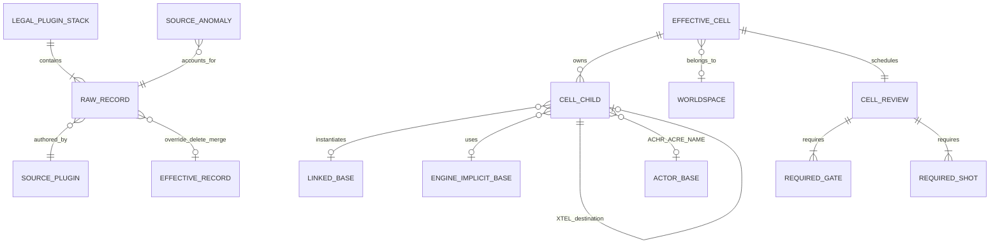
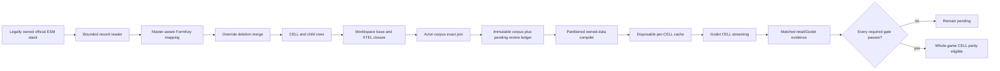

# Whole-game CELL parity

Status: **inventory complete; runtime implementation and matched parity pending**.

This is the fixed denominator for every effective Fallout: New Vegas CELL in
the player's legally owned official plugin stack. It is not a claim that every
CELL renders, streams, simulates, or matches retail yet. The public repository
contains only the compiler, recipe, validator, tests, and documentation; retail
records and generated corpus artifacts remain private and disposable.

## Fixed denominator

The current immutable corpus is
`D:\Builds\OpenNV-cell-parity-corpus-20260824-r4`. Its manifest SHA-256 is
`324399feb4e8d603e5775127fe243a336641f64b076885c8a04b63cdb21c51bb`.

| Entity | Exact rows |
| --- | ---: |
| Raw CELL records | 44,592 |
| Raw CELL-child records | 476,737 |
| Effective CELLs | 44,517 |
| Interior CELLs | 492 |
| Exterior CELLs | 44,025 |
| Effective CELL children | 475,915 |
| REFR | 419,341 |
| ACHR | 3,942 |
| ACRE | 3,739 |
| LAND | 42,467 |
| NAVM | 6,129 |
| PGRE | 297 |
| Linked base/worldspace records | 17,472 |
| Authored XTEL portal edges | 1,378 |
| Engine-implicit base contracts | 2 |
| Exact source anomalies | 2 |
| CELL review rows | 44,517 |
| Relationship or parse gaps | 0 |
| Exact actor-corpus placement join | 7,681 |

The source-to-effective conservation rule passes by record type. For this
official stack it is:

```text
44,592 raw CELL - 75 overrides = 44,517 effective CELL

476,737 raw children
- 687 non-deletion overrides
- 2 * 67 deletion records (the deletion row and the removed prior row)
- 1 invalid undeclared-namespace source row
= 475,915 effective children
```

The two source anomalies are not hidden:

- `GunRunnersArsenal.esm` REFR `02000801` uses undeclared namespace index `02`.
  Its exact record payload is hash-bound and excluded from the effective graph;
  retail treatment remains pending.
- `FalloutNV.esm` LAND `00150fc0` has a bad zlib checksum. Its deflate payload
  has the declared size and is recoverable; both the payload hash and bad-checksum
  fact remain in the corpus, while runtime semantics remain pending.

References to `FalloutNV.esm:000017` and `FalloutNV.esm:000020` are explicit
recipe-owned plane-marker and portal-marker base contracts. They are not missing
STAT records and are not hard-coded in Python. Their required REFR subrecords
are validated, while their renderer/culling semantics remain pending.

## Domain model



One CELL owns many child records. A placed child belongs to exactly one CELL and
usually points many-to-one to a base record. An XTEL door points to another
placed reference, which owns the destination CELL and authored destination
transform. Actor placement identity stays in this graph; actor appearance
assembly remains in the separate actor corpus. The validator requires the
ACHR/ACRE FormKey, parent CELL, and base link to match that corpus exactly.

## One data path



There is no hand-authored placement path. CELL identity, worldspace ownership,
coordinates, child ownership, transforms, scale, base identity, XTEL endpoints,
enable parent, flags, lighting, and subrecord inventory come from owned data.
The only non-retail identities in this corpus are the explicit versioned recipe
contracts above. Inventory status can never promote a runtime or visual gate.

## Meaning of “every CELL works”

A CELL is not working merely because it was parsed. Its review row starts with
every status `pending` and must independently pass:

- record and resource closure;
- geometry, materials, lighting, weather, and effects;
- authored collision and navigation;
- runtime streaming, persistent-reference, enable-state, and save behavior;
- player and projectile continuity for XTEL doors;
- actor/creature placement and state; and
- matched retail/Godot presentation plus human review.

LAND, NAVM, and XTEL rows add their narrower gates. Unsupported subrecords or
semantics remain visible blockers; the compiler may not substitute a proxy,
default placement, guessed material, or hand-authored room.

## Execution order

1. Partition the corpus into immutable per-worldspace/per-CELL compile jobs and
   disposable content-addressed cache outputs.
2. Produce a child/base/subrecord capability matrix; fail each job closed on an
   unimplemented semantic rather than omitting the row.
3. Generalize owned-data compilation for static references, LAND, NAVM, lights,
   XTEL doors, actors/creatures, and resource closure.
4. Stream one authoritative CELL entity root per active CELL, including
   persistent references, worldspace coordinates, portals, and save state.
5. Add independent package, dialogue, quest, script, scene, weather, and
   enable-parent state graphs needed to reproduce the authored loaded state.
6. Close representative interior, exterior, landscape, navigation, portal, and
   actor differentials before starting the exhaustive 44,517-row review queue.
7. Promote flat and first-class VR gameplay only through the same authoritative
   state, interaction, physics, projectile, save, and evidence paths.

The immediate next implementation slice is the partitioned per-CELL owned-data
compiler and capability ledger. It replaces the bounded Goodsprings selection
as the general path without deleting that proven vertical-slice acceptance test.

## Partitioned compile plan

That first planning slice is now complete at
`D:\Builds\OpenNV-cell-compile-plan-20260824-r1`, with manifest SHA-256
`525926f5ddc12716217d58f919a7558b31b4d42d21defd57a69889538d912b5a`.
The independent validator proves:

| Compile-plan entity | Exact rows |
| --- | ---: |
| CELL jobs | 44,517 |
| Child relationships | 475,915 |
| Natural partitions | 38 |
| Capability definitions | 173 |
| Deduplicated capability sets | 2,248 |
| Source anomalies assigned to parent CELLs | 2 |
| Pending jobs | 44,517 |
| Ready jobs | 0 |

The plan is 47,671,803 bytes total and is split by authored exterior worldspace
or interior source-plugin ownership. Its largest shard is the main WastelandNV
worldspace at 16,340,678 bytes; there is no whole-game runtime blob. Each job
contains the exact child FormKeys, source CELL hash, capability-set identity,
review gates/shots, and source-anomaly assignments. Every compile output starts
`not-built`; parsing and scheduling did not promote any implementation status.

The next slice is no longer planning. It is the content-addressed per-CELL
compiler output contract, starting with one representative member of each
capability family and retaining explicit blockers for every unsupported member.
